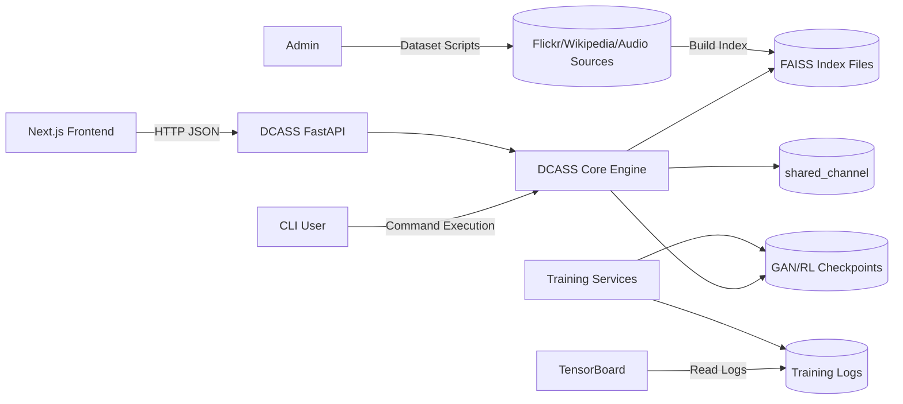

# DCASS External Interfaces Diagram

## 6.5 External Interfaces

```mermaid
flowchart LR
  %% 6.5 External Interfaces Diagram
  FE[Next.js Frontend] -->|HTTP JSON| API[DCASS FastAPI]
  CLI[CLI User] -->|Command Execution| CORE[DCASS Core Engine]
  API --> CORE

  CORE --> IDX[(FAISS Index Files)]
  CORE --> MODELS[(GAN/RL Checkpoints)]
  CORE --> SHARED[(shared_channel)]

  ADMIN[Admin] -->|Dataset Scripts| RAW[(Flickr/Wikipedia/Audio Sources)]
  RAW -->|Build Index| IDX

  TB[TensorBoard] -->|Read Logs| LOGS[(Training Logs)]
  TRAIN[Training Services] --> LOGS
  TRAIN --> MODELS
```
