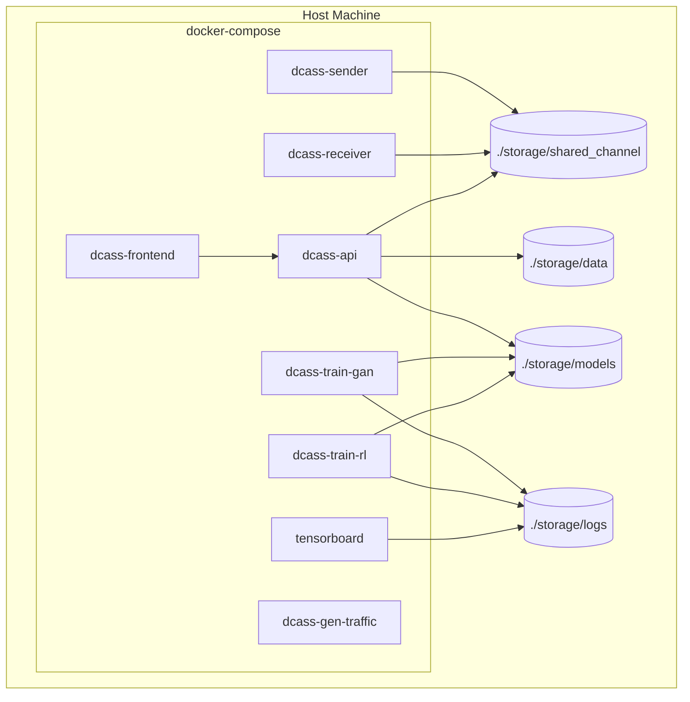

# DCASS Packaging and Deployment Diagram

## 6.6 Packaging and Deployment Diagram

```mermaid
flowchart TB
  %% 6.6 Packaging and Deployment Diagram
  subgraph Host["Host Machine"]
    subgraph DockerCompose["docker-compose"]
      F[dcass-frontend]
      A[dcass-api]
      S[dcass-sender]
      R[dcass-receiver]
      G[dcass-gen-traffic]
      TG[dcass-train-gan]
      TR[dcass-train-rl]
      T[tensorboard]
    end

    V1[(./storage/data)]
    V2[(./storage/models)]
    V3[(./storage/shared_channel)]
    V4[(./storage/logs)]
  end

  F --> A
  S --> V3
  R --> V3
  A --> V1
  A --> V2
  A --> V3
  TG --> V2
  TR --> V2
  TG --> V4
  TR --> V4
  T --> V4
```
