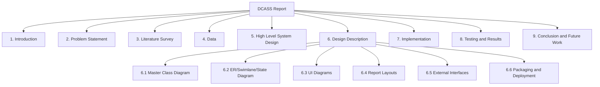

# DCASS Report Layout Diagram

## 6.4 Report Layouts

```mermaid
flowchart TD
  %% 6.4 Report Layout Diagram
  R[DCASS Report]
  R --> R1[1. Introduction]
  R --> R2[2. Problem Statement]
  R --> R3[3. Literature Survey]
  R --> R4[4. Data]
  R --> R5[5. High Level System Design]
  R --> R6[6. Design Description]
  R --> R7[7. Implementation]
  R --> R8[8. Testing and Results]
  R --> R9[9. Conclusion and Future Work]

  R6 --> R61[6.1 Master Class Diagram]
  R6 --> R62[6.2 ER/Swimlane/State Diagram]
  R6 --> R63[6.3 UI Diagrams]
  R6 --> R64[6.4 Report Layouts]
  R6 --> R65[6.5 External Interfaces]
  R6 --> R66[6.6 Packaging and Deployment]
```
