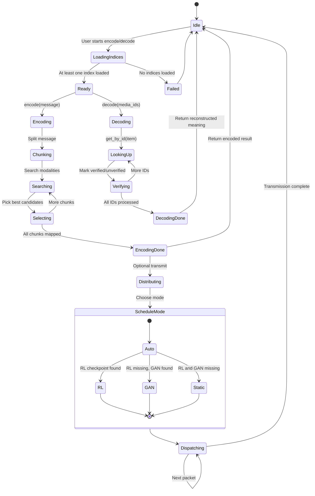

# DCASS State Diagram

## 6.2 State Diagram

```mermaid
stateDiagram-v2
    [*] --> Idle

    Idle --> LoadingIndices: User starts encode/decode
    LoadingIndices --> Ready: At least one index loaded
    LoadingIndices --> Failed: No indices loaded
    Failed --> Idle

    Ready --> Encoding: encode(message)
    Encoding --> Chunking: Split message
    Chunking --> Searching: Search modalities
    Searching --> Selecting: Pick best candidates
    Selecting --> Searching: More chunks
    Selecting --> EncodingDone: All chunks mapped

    EncodingDone --> Distributing: Optional transmit
    EncodingDone --> Idle: Return encoded result

    Distributing --> ScheduleMode: Choose mode
    state ScheduleMode {
        [*] --> Auto
        Auto --> RL: RL checkpoint found
        Auto --> GAN: RL missing, GAN found
        Auto --> Static: RL and GAN missing
        RL --> [*]
        GAN --> [*]
        Static --> [*]
    }

    ScheduleMode --> Dispatching
    Dispatching --> Dispatching: Next packet
    Dispatching --> Idle: Transmission complete

    Ready --> Decoding: decode(media_ids)
    Decoding --> LookingUp: get_by_id(item)
    LookingUp --> Verifying: Mark verified/unverified
    Verifying --> LookingUp: More IDs
    Verifying --> DecodingDone: All IDs processed
    DecodingDone --> Idle: Return reconstructed meaning
```
