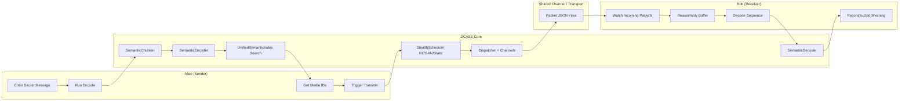

# DCASS Swimlane Diagram

## 6.2 Swimlane Diagram

```mermaid
flowchart LR
  %% 6.2 Swimlane Diagram (Encoding to Decoding)
  subgraph Alice_Sender["Alice (Sender)"]
    A1[Enter Secret Message]
    A2[Run Encode]
    A3[Get Media IDs]
    A4[Trigger Transmit]
  end

  subgraph DCASS_Core["DCASS Core"]
    C1[SemanticChunker]
    C2[SemanticEncoder]
    C3[UnifiedSemanticIndex Search]
    C4[StealthScheduler RL/GAN/Static]
    C5[Dispatcher + Channels]
    C6[SemanticDecoder]
  end

  subgraph Shared_Channel["Shared Channel / Transport"]
    S1[Packet JSON Files]
  end

  subgraph Bob_Receiver["Bob (Receiver)"]
    B1[Watch Incoming Packets]
    B2[Reassembly Buffer]
    B3[Decode Sequence]
    B4[Reconstructed Meaning]
  end

  A1 --> A2 --> C1 --> C2 --> C3 --> A3 --> A4 --> C4 --> C5 --> S1 --> B1 --> B2 --> B3 --> C6 --> B4
```
