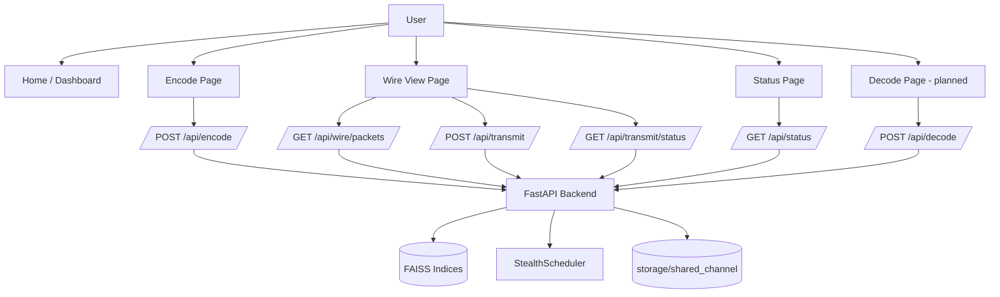

# DCASS User Interface Diagrams

## 6.3 User Interface Diagram

```mermaid
flowchart TB
  %% 6.3 User Interface Diagram
  U[User]
  U --> H[Home / Dashboard]
  U --> E[Encode Page]
  U --> W[Wire View Page]
  U --> S[Status Page]
  U --> D[Decode Page - planned]

  E --> API1[/POST /api/encode/]
  W --> API2[/GET /api/wire/packets/]
  W --> API3[/POST /api/transmit/]
  W --> API4[/GET /api/transmit/status/]
  S --> API5[/GET /api/status/]
  D --> API6[/POST /api/decode/]

  API1 --> BE[FastAPI Backend]
  API2 --> BE
  API3 --> BE
  API4 --> BE
  API5 --> BE
  API6 --> BE

  BE --> IDX[(FAISS Indices)]
  BE --> SCH[StealthScheduler]
  BE --> SH[(storage/shared_channel)]
```
