# DCASS — Dynamic Context-Aware Semantic Steganography
## Complete Implementation Handout

> **Version**: 0.1.0 | **Date**: April 2026  
> **Project Type**: Capstone — Semantic Steganography System  
> **Language**: Python 3.x | **Key Libs**: PyTorch, CLIP, FAISS, CLAP, Sentence-Transformers

---

## Table of Contents

1. [Project Overview](#1-project-overview)
2. [High-Level Architecture](#2-high-level-architecture)
3. [Directory Structure](#3-directory-structure)
4. [Data Files & Assets](#4-data-files--assets)
5. [Embedding Models & Indices](#5-embedding-models--indices)
6. [Module-by-Module Walkthrough](#6-module-by-module-walkthrough)
7. [End-to-End Flow: Encoding Pipeline](#7-end-to-end-flow-encoding-pipeline)
8. [End-to-End Flow: Decoding Pipeline](#8-end-to-end-flow-decoding-pipeline)
9. [Distribution & Scheduling Pipeline](#9-distribution--scheduling-pipeline)
10. [Stealth AI System (GAN + RL)](#10-stealth-ai-system-gan--rl)
11. [Analysis & Benchmarking](#11-analysis--benchmarking)
12. [State Machines & Control Flow](#12-state-machines--control-flow)
13. [Configuration System](#13-configuration-system)
14. [CLI Interface](#14-cli-interface)
15. [Key Design Decisions](#15-key-design-decisions)
16. [Data Flow Summary Table](#16-data-flow-summary-table)

---

## 1. Project Overview

**DCASS** hides secret messages inside sequences of **unmodified, publicly available media items** (images, text snippets, audio clips). Unlike traditional steganography which modifies pixel values or audio waveforms, DCASS:

1. **Never modifies** any media file  
2. **Encodes** a message by *selecting* existing media items whose semantic meaning matches each chunk of the message  
3. **Decodes** by looking up those same media items in a shared corpus and reading back their captions/text  

This makes it extremely resistant to detection — the transmitted media is 100% genuine, publicly-available content.

### Core Concept

```
Sender                                                    Receiver
─────                                                     ────────
"Meet me at the park"                                      
   │                                                       
   ▼                                                       
┌──────────────┐                                           
│ CHUNKER      │ → ["meet me", "park"]                     
└──────┬───────┘                                           
       ▼                                                   
┌──────────────┐   FAISS search                            
│ ENCODER      │ → [flickr_img_043, wiki_007]              
└──────┬───────┘                                           
       ▼ (media IDs transmitted)                           
┌──────────────┐                                ┌──────────────┐
│ DISTRIBUTOR  │ ───── channels ────────────────▶│ DECODER      │
└──────────────┘                                └──────┬───────┘
                                                       ▼
                                           "people gathering | park"
```

---

## 2. High-Level Architecture

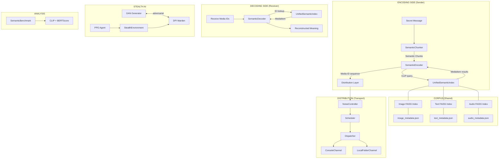

---

## 3. Directory Structure

```
dcass/
├── config/
│   ├── __init__.py
│   ├── default.yaml          # All configuration parameters
│   └── settings.py           # Singleton Config class (YAML loader)
│
├── data/
│   ├── raw/
│   │   ├── Captions.csv      # 12.8 MB — Flickr8k/30k captions
│   │   ├── flickr8k/         # Flickr8k images + captions
│   │   └── flickr30k/        # Flickr30k images + captions
│   ├── indices/
│   │   ├── image.index       # 65 MB FAISS index (CLIP 512-dim)
│   │   ├── image_metadata.json  # 23 MB metadata
│   │   ├── text.index        # 82 MB FAISS index (CLIP 512-dim)
│   │   ├── text_metadata.json   # 11 MB metadata
│   │   ├── audio.index       # 28 MB FAISS index (CLIP/CLAP 512-dim)
│   │   └── audio_metadata.json  # 4.3 MB metadata
│   ├── benchmarks/
│   │   ├── test_messages.json # 60 test messages across 7 categories
│   │   └── results/          # Benchmark output JSON files
│   └── audio/                # Audio corpus data
│
├── src/
│   ├── engine/               # Core encode/decode logic
│   │   ├── encoder.py        # SemanticEncoder
│   │   ├── decoder.py        # SemanticDecoder
│   │   ├── chunker.py        # SemanticChunker
│   │   └── context/          # Dynamic context sources (placeholder)
│   │
│   ├── corpus/               # Data loading, embedding, indexing
│   │   ├── embedders/        # Embedding model wrappers
│   │   │   ├── base_embedder.py
│   │   │   ├── clip_embedder.py   # CLIP ViT-B/32 (512-dim)
│   │   │   ├── image_embedder.py  # CLIP for images
│   │   │   ├── text_embedder.py   # Sentence-Transformers (384-dim)
│   │   │   ├── audio_embedder.py  # CLAP (512-dim)
│   │   │   └── vector_engine.py   # Legacy FAISS wrapper
│   │   ├── index/
│   │   │   └── unified_index.py   # UnifiedSemanticIndex + ScoreNormalizer
│   │   ├── loaders/
│   │   │   ├── base_loader.py
│   │   │   ├── flickr_loader.py   # Flickr8k/30k dataset loader
│   │   │   └── wikipedia_loader.py # Wikipedia text loader
│   │   └── preprocessors/
│   │       └── chunker.py         # Text chunker for corpus prep
│   │
│   ├── distribution/         # Multi-channel dispatch + timing
│   │   ├── base_channel.py
│   │   ├── console_channel.py
│   │   ├── local_folder_channel.py
│   │   ├── channel_registry.py
│   │   ├── dispatcher.py     # Round-robin / fixed / alternating
│   │   ├── scheduler.py      # Timed dispatch execution
│   │   ├── noise.py          # Timing jitter & random skips
│   │   └── profiles.py       # Behavioral profiles (casual, bursty, etc.)
│   │
│   ├── stealth/              # AI-driven stealth evasion
│   │   ├── gan/
│   │   │   ├── generator.py  # TemporalPatternGenerator (GRU + Attention)
│   │   │   └── trainer.py    # GANTrainer adversarial loop
│   │   └── rl/
│   │       ├── agent.py      # PPOAgent (Actor-Critic)
│   │       └── environment.py # StealthEnvironment (Gym-style)
│   │
│   ├── analysis/             # Evaluation & adversarial testing
│   │   ├── adversarial/
│   │   │   └── warden.py     # DeepPacketInspectionWarden (BiLSTM + Transformer)
│   │   └── benchmarks/
│   │       ├── metrics.py    # CLIPSimilarity, BERTScore, CombinedMetrics
│   │       ├── semantic_benchmark.py # Full benchmark runner
│   │       └── report.py     # Report generation
│   │
│   ├── cli/
│   │   └── main.py           # Full CLI with encode/decode/demo/search/etc.
│   │
│   └── utils/
│       └── config.py         # Config helper
│
├── scripts/                  # Build/download/demo scripts
│   ├── build_indices.py      # Build FAISS indices from raw data
│   ├── build_flickr30k_index.py
│   ├── download_flickr8k.py
│   ├── download_wikipedia.py
│   ├── add_wikipedia_to_index.py
│   ├── audio_step1_download.py
│   ├── audio_step2_build_index.py
│   ├── demo_dcass.py
│   ├── run_sender.py
│   ├── run_receiver.py
│   └── ...
│
├── audio/                    # Audio pipeline utilities
│   ├── build_audio_faiss.py
│   ├── encode_audio_clap.py
│   ├── query_audio_faiss.py
│   └── ...
│
├── tests/                    # Test suite
│   ├── test_corpus/
│   ├── test_distribution/
│   ├── test_engine/
│   └── test_stealth/
│
├── phase3_out/               # Distribution output (timestamped .txt files)
├── Dockerfile
├── docker-compose.yml
├── Makefile
└── requirements.txt
```

---

## 4. Data Files & Assets

### 4.1 Raw Corpus Data

| File / Directory | Size | Description | Used By |
|---|---|---|---|
| `data/raw/Captions.csv` | 12.8 MB | Master CSV with image_id → caption mappings | `FlickrLoader` |
| `data/raw/flickr8k/` | — | Flickr8k images + `Flickr8k.token.txt` or `captions.txt` | `FlickrLoader`, `build_indices.py` |
| `data/raw/flickr30k/` | — | Flickr30k images directory | `build_flickr30k_index.py` |
| `data/raw/wikipedia/` | — | Wikipedia `.txt` articles + `sentences.json` | `WikipediaLoader`, `add_wikipedia_to_index.py` |
| `data/audio/` | — | Audio dataset files | Audio pipeline scripts |

### 4.2 FAISS Indices (Pre-built)

| File | Size | Embedding Dim | # Vectors | Model |
|---|---|---|---|---|
| `data/indices/image.index` | 65 MB | 512 | ~31,000 | CLIP ViT-B/32 |
| `data/indices/image_metadata.json` | 23 MB | — | ~31,000 | Flickr8k/30k IDs, paths, captions |
| `data/indices/text.index` | 82 MB | 512 | ~40,000 | CLIP ViT-B/32 (text encoder) |
| `data/indices/text_metadata.json` | 11 MB | — | ~40,000 | Flickr captions + Wikipedia sentences |
| `data/indices/audio.index` | 28 MB | 512 | ~13,000 | CLAP htsat-unfused |
| `data/indices/audio_metadata.json` | 4.3 MB | — | ~13,000 | Audio file paths + descriptions |

> [!IMPORTANT]
> **All three indices use 512-dimensional embeddings** that live in compatible vector spaces. Images and text both use **CLIP ViT-B/32**. Audio uses **CLAP** (which produces a similar 512-dim space). The `ScoreNormalizer` class handles calibration differences.

### 4.3 Benchmark Data

| File | Description |
|---|---|
| `data/benchmarks/test_messages.json` | 60 test messages across 7 categories: simple, commands, descriptions, abstract, conversational, complex, technical |
| `data/benchmarks/results/` | Output directory for benchmark run JSON files |

### 4.4 Distribution Output

| Directory | Description |
|---|---|
| `phase3_out/` | Contains 46+ timestamped `.txt` files from distribution runs. Each file contains `IMAGE_ID=<id>` plus metadata. Filenames encode timestamp + media_id. |
| `audio/audio_paths.pkl` | Pickled list of audio file paths for the audio pipeline |

---

## 5. Embedding Models & Indices

### 5.1 Embedding Models Used

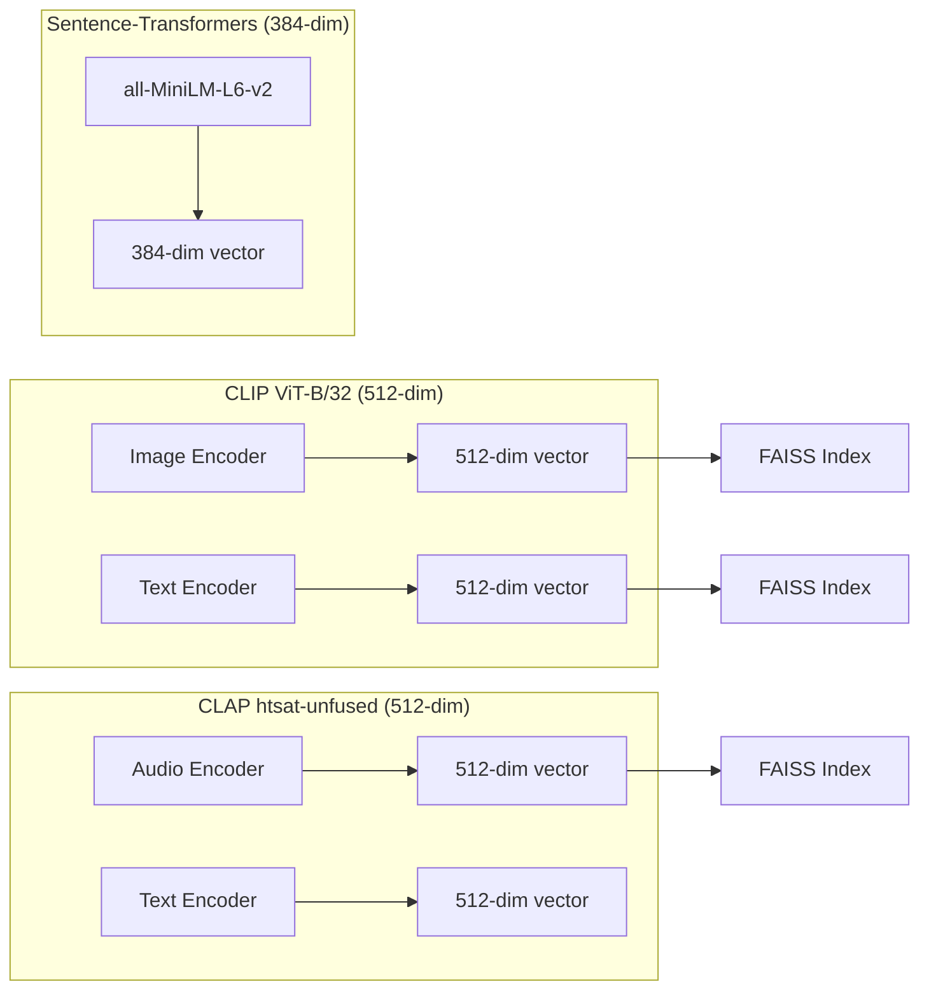

| Model | Library | Dimension | Used For | Files |
|---|---|---|---|---|
| **CLIP ViT-B/32** | `openai/clip` | **512** | Image encoding, Text encoding (for index building & querying) | `clip_embedder.py`, `image_embedder.py`, `unified_index.py` |
| **CLAP htsat-unfused** | `transformers` | **512** | Audio encoding, Text-to-audio search | `audio_embedder.py` |
| **all-MiniLM-L6-v2** | `sentence-transformers` | **384** | Legacy text embedding, BERTScore fallback | `text_embedder.py`, `vector_engine.py`, `metrics.py` |
| **DeBERTa-base-mnli** | `transformers` | — | BERTScore metric computation | `metrics.py` |

### 5.2 How Indices Are Built

The `scripts/build_indices.py` script (and related scripts) performs:

1. **Load raw data** → `FlickrLoader` reads image files + captions
2. **Generate CLIP embeddings** → `ImageEmbedder.encode_images()` for images, `ImageEmbedder.encode_text()` for captions
3. **Build FAISS flat index** → `faiss.IndexFlatIP(512)` (Inner Product = Cosine Similarity on normalized vectors)
4. **Save metadata JSON** → Each entry has `{id, content, caption, modality, ...}`
5. **Write to disk** → `data/indices/{modality}.index` + `{modality}_metadata.json`

### 5.3 How Indices Are Used at Runtime

```
Query text ("a dog on the beach")
    │
    ▼
UnifiedSemanticIndex._encode_text(query)
    │  Uses CLIP text encoder → 512-dim vector
    ▼
For each loaded modality (image, text, audio):
    │
    ├─ faiss_index.search(query_vector, k)
    │    Returns: raw_scores[], indices[]
    │
    ├─ ScoreNormalizer.normalize(raw_score, modality)
    │    Z-score + sigmoid → [0, 1] comparable score
    │
    └─ Build MediaItem objects with normalized scores
    │
    ▼
Merge all results → Sort by normalized_score DESC → Return top-k
```

### 5.4 Score Normalization (Critical Detail)

Raw similarity scores differ wildly across modalities:
- **text-to-text (CLIP)**: ~0.6–0.9
- **text-to-image (CLIP)**: ~0.2–0.4
- **text-to-audio (CLAP)**: ~0.1–0.2

The `ScoreNormalizer` class uses empirically calibrated per-modality `(mean, std)` values:

```python
DEFAULT_CALIBRATION = {
    "image": (0.271, 0.028),
    "text":  (0.885, 0.053),
    "audio": (0.100, 0.021),
}
```

Formula: `normalized = sigmoid((raw - mean) / std)`

This maps all modalities to a comparable `[0, 1]` range so that the encoder can fairly compare an image match vs. a text match vs. an audio match.

---

## 6. Module-by-Module Walkthrough

### 6.1 `src/engine/chunker.py` — SemanticChunker

**Purpose**: Splits a secret message into semantic units suitable for corpus matching.

**Pipeline**:
```
Input Message
    │
    ├─ Step 1: Split on sentence boundaries (`.` `!` `?`)
    ├─ Step 2: Split on delimiters (`,`, `and`, `but`, `at the`, etc.)
    ├─ Step 3: Clean each part (lowercase, strip punctuation)
    ├─ Step 4: Split long chunks (>60 chars) at prepositions
    ├─ Step 5: Optionally expand with synonyms
    └─ Step 6: Filter by min length (≥3 chars)
    │
    ▼
List[SemanticChunk(text, original, index)]
```

**Key Features**:
- 30+ delimiter patterns (commas, conjunctions, prepositions)
- Built-in synonym dictionary (~30 words → 100+ synonyms)
- Smart long-chunk splitting at natural break points
- Fallback: treat entire message as one chunk if no splits found

---

### 6.2 `src/engine/encoder.py` — SemanticEncoder

**Purpose**: Transforms semantic chunks into a sequence of media items.

**Key Parameters**:
- `diversity_mode`: `"best"` | `"round_robin"` | `"balanced"`
- `avoid_duplicates`: Each chunk gets a unique media item
- `k_per_chunk`: Media items per chunk (usually 1)
- `min_score`: Minimum normalized score threshold

**Encoding Algorithm**:
```
For each SemanticChunk:
    1. Determine search modalities based on diversity_mode
    2. Search UnifiedSemanticIndex with chunk.text
    3. If no results → fallback to chunk.original (without synonyms)
    4. If round_robin and no results → try all modalities
    5. Filter out already-used IDs (avoid_duplicates)
    6. For balanced mode → re-sort by (modality_count, -score)
    7. Select top-k → EncodedChunk
    8. Mark ID as used, update modality_counts
```

**Diversity Modes**:
| Mode | Behavior |
|---|---|
| `best` | Pick highest-scoring item regardless of modality |
| `round_robin` | Cycle: image → text → audio → image → ... |
| `balanced` | Prefer underrepresented modalities to equalize distribution |

---

### 6.3 `src/engine/decoder.py` — SemanticDecoder

**Purpose**: Reverses encoding by looking up media IDs in the corpus.

**Algorithm**:
```
For each media_id:
    1. Call index.get_by_id(media_id) — linear scan through metadata
    2. If found:
       - Extract content based on modality:
         - text → metadata["text"]
         - image → metadata["caption"]
         - audio → metadata["text"] or metadata["transcript"]
       - Mark as verified=True
    3. If not found:
       - Mark as verified=False, content="[UNVERIFIED: id]"
    4. Reconstruct meaning: join all contents with " | " separator
```

**Outputs**:
- `DecodingResult.reconstructed_meaning` → human-readable decoded text
- `DecodingResult.verification_rate` → fraction of IDs found in corpus (tamper detection)

---

### 6.4 `src/corpus/index/unified_index.py` — UnifiedSemanticIndex

**Purpose**: Unified multi-modal search interface over three FAISS indices.

**Components**:
- `indices: dict[Modality, faiss.Index]` — loaded FAISS indices
- `metadata: dict[Modality, list[dict]]` — parallel metadata lists
- `normalizer: ScoreNormalizer` — cross-modality score calibration
- `_clip_model` — lazy-loaded CLIP ViT-B/32 for query encoding

**Key Methods**:
| Method | Description |
|---|---|
| `load(modalities)` | Load FAISS indices + metadata from disk |
| `search(query, k, modalities, min_score)` | Cross-modal semantic search |
| `get_by_id(item_id)` | Retrieve item by ID (linear scan) |
| `_encode_text(text)` | CLIP text encoding for queries |

---

### 6.5 `src/corpus/embedders/` — Embedding Wrappers

| Class | Model | Dim | Used For |
|---|---|---|---|
| `CLIPEmbedder` | CLIP ViT-B/32 | 512 | General-purpose image+text embedding |
| `ImageEmbedder` | CLIP ViT-B/32 | 512 | Image-specific encoding with batch support |
| `TextEmbedder` | all-MiniLM-L6-v2 | 384 | Sentence-transformers text embedding (legacy) |
| `AudioEmbedder` | CLAP htsat-unfused | 512 | Audio + text-for-audio embedding |
| `VectorEngine` | all-MiniLM-L6-v2 | 384 | Legacy FAISS index builder |

---

### 6.6 `src/corpus/loaders/` — Data Loaders

| Class | Source | Output |
|---|---|---|
| `FlickrLoader` | Flickr8k/30k directory | `{id, image_path, caption, captions[]}` |
| `WikipediaLoader` | Wikipedia `.txt` files | `{id, content, metadata}` |

**FlickrLoader** supports multiple caption formats:
- `Flickr8k.token.txt` format: `image.jpg#0\tcaption`
- CSV format: `image,caption`
- Fallback: generate caption from filename

---

### 6.7 `src/distribution/` — Distribution Layer

**Purpose**: Transmit encoded media IDs through channels with realistic timing.

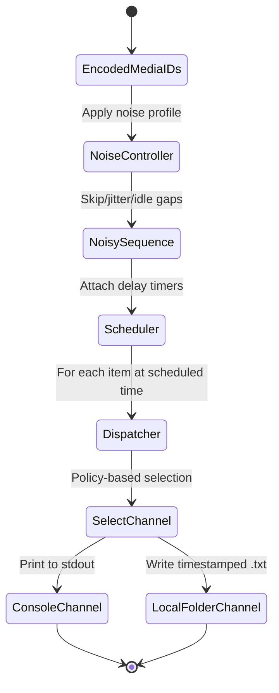

**Sub-components**:

| Component | File | Role |
|---|---|---|
| `BaseChannel` | `base_channel.py` | Abstract channel interface |
| `ConsoleChannel` | `console_channel.py` | Prints `[CONSOLE] timestamp | image_id` |
| `LocalFolderChannel` | `local_folder_channel.py` | Writes `phase3_out/{timestamp}_{id}.txt` |
| `Dispatcher` | `dispatcher.py` | Selects channel per policy (round_robin/fixed/alternating) |
| `Scheduler` | `scheduler.py` | Executes timed dispatch with `time.sleep()` |
| `NoiseController` | `noise.py` | Adds skip probability, delay jitter, idle gaps |
| `profiles.py` | `profiles.py` | Pre-defined behavioral profiles |

**Activity Profiles**:

| Profile | skip_prob | jitter | idle_gap_prob | idle_gap_range |
|---|---|---|---|---|
| `casual` | 15% | (-1, 3)s | 30% | (8, 20)s |
| `steady` | 5% | (0, 1)s | 5% | (3, 6)s |
| `bursty` | 20% | (-2, 2)s | 40% | (15, 40)s |
| `night_owl` | 10% | (-3, 4)s | 50% | (20, 60)s |
| `debug` | 0% | (0, 0)s | 0% | (0, 0)s |

---

### 6.8 `src/stealth/gan/` — GAN-Based Stealth

**Purpose**: Learn to generate human-like transmission timing patterns that fool the Warden.

#### TemporalPatternGenerator (Generator)

**Architecture**: `Latent Noise (128-dim) + Time Embedding → GRU (2-layer) → Multi-Head Attention (8 heads) → Output Heads`

**Output Heads**:
1. **Delay Head** → Inter-transmission delays (Softplus → positive values)
2. **Channel Head** → Channel selection logits (Categorical distribution)
3. **Confidence Head** → Generator confidence score (Sigmoid → [0,1])

**Time-of-day encoding**: Cyclical sin/cos encoding of hour → avoids midnight discontinuity

#### GANTrainer

**Training Loop**:
```
For each epoch:
    For each batch of real human traffic:
        1. Train Warden (5 steps):
           - Generate fake traffic from Generator
           - Get Warden verdicts on real + fake
           - BCE loss with label smoothing
           - Optional: WGAN-GP gradient penalty
        2. Train Generator (1 step):
           - Generate fake traffic
           - Get Warden verdict
           - Loss = -log(1 - P(bot))  (fool the Warden)
```

---

### 6.9 `src/stealth/rl/` — RL-Based Stealth

**Purpose**: Train an RL agent to optimize transmission scheduling for throughput vs. stealth trade-off.

#### StealthEnvironment (Gym-style)

**State Space** (16-dim vector):
- Queue size (normalized)
- Time of day (sin/cos cyclical)
- Per-channel: rate_limit, time_since_last, transmission_count
- History features: avg_delay, delay_std, channel_diversity, tx_rate

**Action Space**:
- `delay`: Continuous (seconds to wait before sending)
- `channel`: Discrete (which channel to use)

**Reward Function**: `R = Throughput (items/min) − λ × Warden_Score`

#### PPOAgent (Actor-Critic)

**Architecture**: `State → Shared MLP (256) → Actor (delay Gaussian + channel Categorical) + Critic (V(s))`

**PPO Training**:
- Clipped surrogate objective (ε = 0.2)
- Value loss + entropy bonus
- GAE-style advantage estimation

---

### 6.10 `src/analysis/adversarial/warden.py` — DPI Warden

**Purpose**: Adversarial Warden simulating Deep Packet Inspection to detect steganographic traffic.

**Architecture**: `Traffic Timeline → Feature Extraction → BiLSTM (2-layer) → Transformer Encoder (4 layers) → Classification`

**Detection Features**:
1. **Statistical features** (16-dim): mean, std, min, max, CV, skewness, kurtosis, range, lag-1 autocorrelation, MAD
2. **Delay embedding**: log-scale Linear → 64-dim
3. **Channel embedding**: Learned 32-dim per channel
4. **Anomaly scores**: Per-timestamp anomaly detection head
5. **Classification**: Dual pooling (mean + max) → MLP → P(bot)

**Loss**:
- Standard BCE with label smoothing (0.1)
- Optional WGAN-GP gradient penalty

---

### 6.11 `src/analysis/benchmarks/` — Benchmarking

**Purpose**: Evaluate semantic recovery accuracy across diversity modes and message categories.

**Metrics**:
| Metric | Model | Measures | Range |
|---|---|---|---|
| CLIP Similarity | CLIP ViT-B/32 | Cosine similarity of embeddings | [0, 1] |
| BERTScore | DeBERTa-base-mnli (or SentenceTransformer fallback) | Contextual token-level F1 | [0, 1] |

**Benchmark Flow**:
```
For each diversity_mode in [best, round_robin, balanced]:
    For each (category, message) in test_messages.json:
        1. Encode message → media_ids
        2. Decode media_ids → reconstructed_meaning
        3. Compute CLIP Similarity(original, reconstructed)
        4. Compute BERTScore(original, reconstructed)
        5. Record timing, verification, modality breakdown
```

---

## 7. End-to-End Flow: Encoding Pipeline

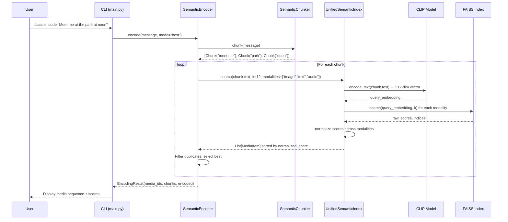

**Detailed Steps**:

1. **CLI parses arguments** → message, mode, modality
2. **SemanticEncoder.load()** → loads all FAISS indices + metadata + CLIP model
3. **SemanticChunker.chunk(message)** →
   - Split on sentences → split on delimiters → clean → split long chunks → expand synonyms
   - Example: "Meet me at the park at noon" → `["meet me", "park", "noon"]`
4. **For each chunk**: SemanticEncoder searches the UnifiedSemanticIndex:
   - CLIP encodes the chunk text → 512-dim query vector
   - FAISS inner-product search across each modality index
   - ScoreNormalizer calibrates raw scores to [0,1]
   - Merge and sort all results by normalized_score
   - Filter used IDs (avoid_duplicates), apply diversity mode logic
   - Select top match → `EncodedChunk`
5. **Return**: `EncodingResult` with `media_ids`, `chunks`, `modality_breakdown`

---

## 8. End-to-End Flow: Decoding Pipeline

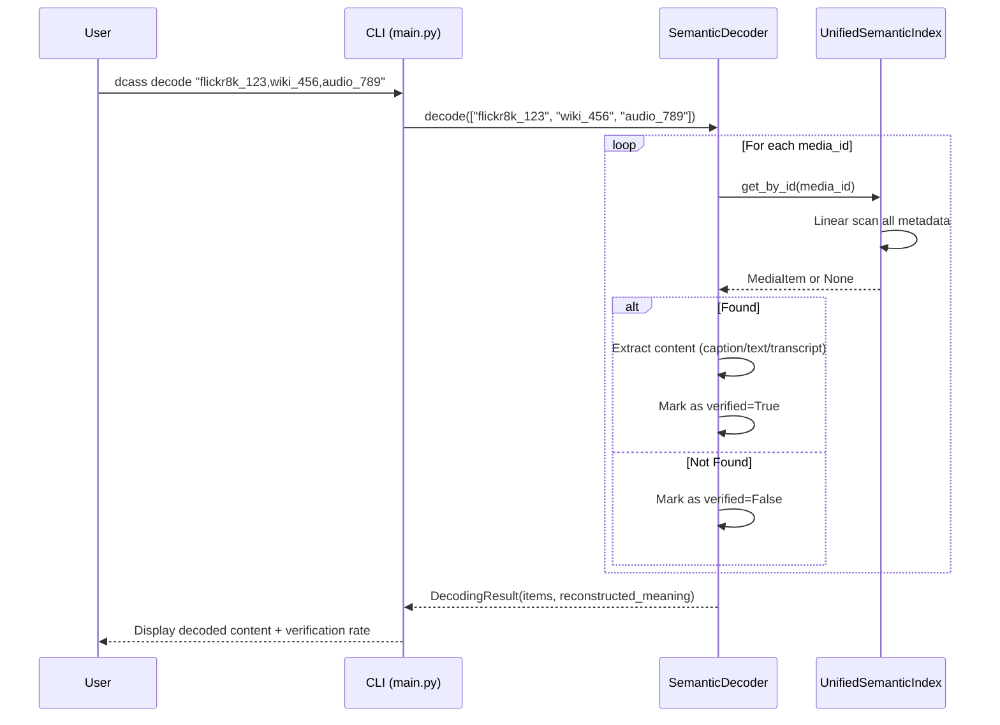

**Reconstructed Meaning**: All verified content strings joined with ` | ` separator.

---

## 9. Distribution & Scheduling Pipeline

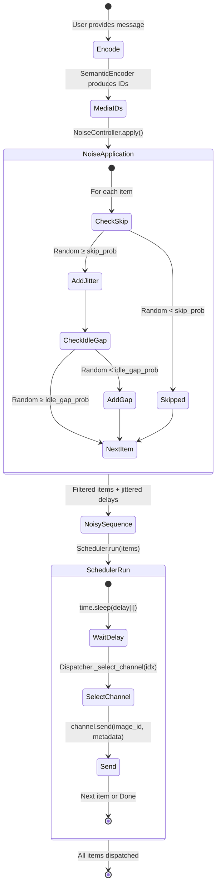

---

## 10. Stealth AI System (GAN + RL)

### GAN Training State Machine

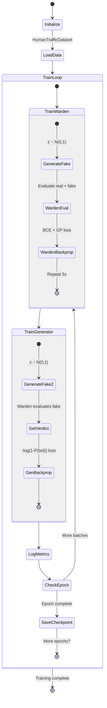

### RL Agent Training State Machine

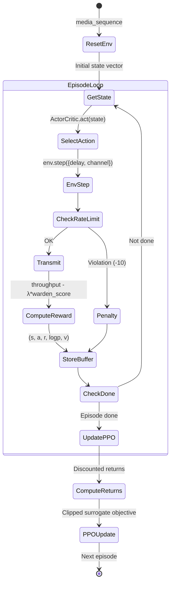

---

## 11. Analysis & Benchmarking

### Benchmark Execution Flow

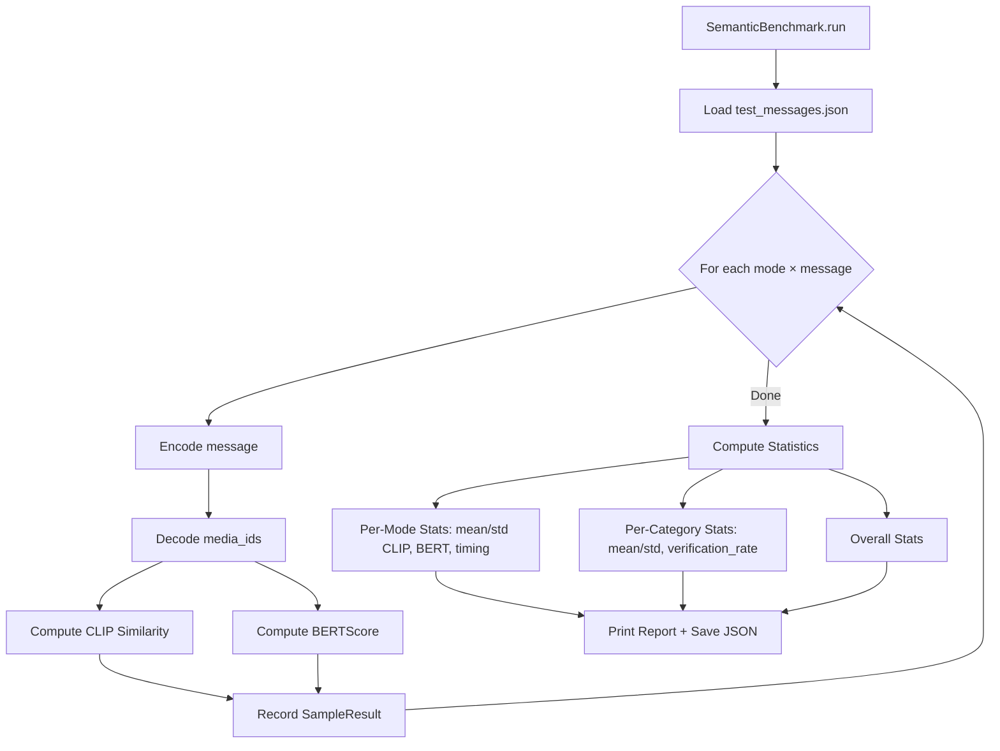

### Warden Analysis Pipeline

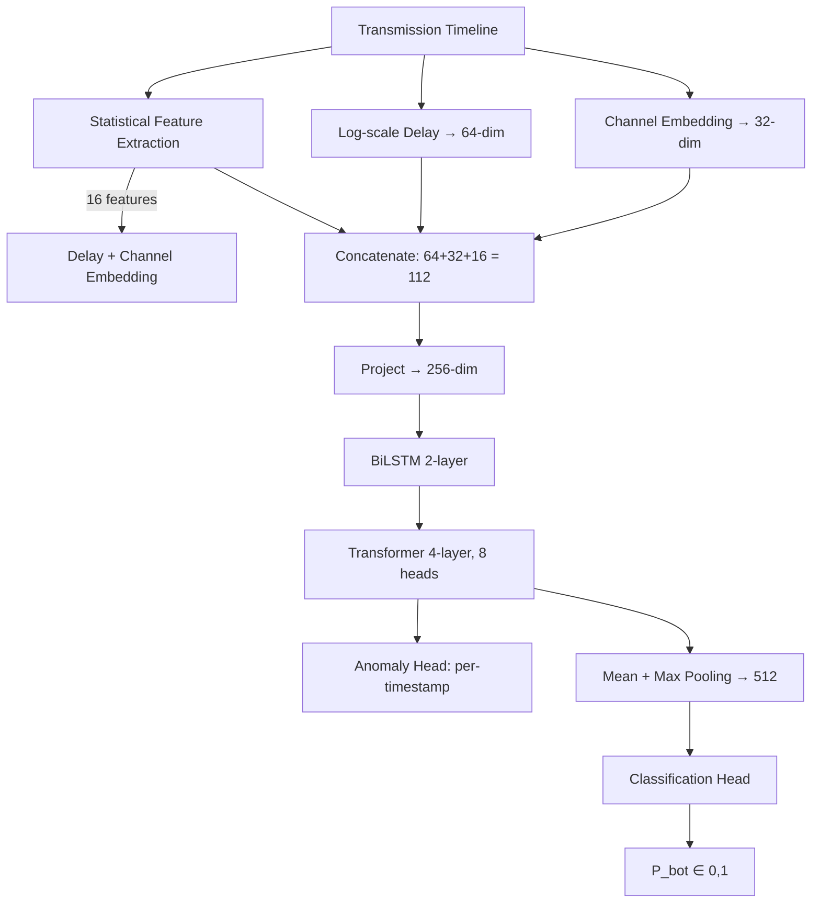

---

## 12. State Machines & Control Flow

### Overall System State Machine

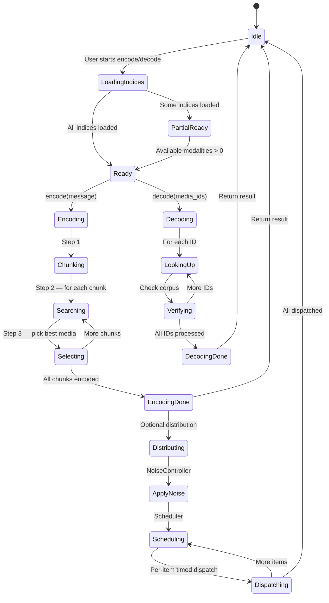

### Index Loading State Machine

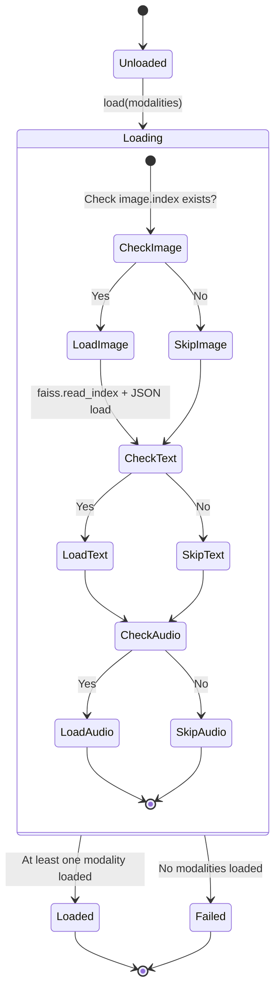

---

## 13. Configuration System

### `config/default.yaml` — All Parameters

| Section | Key Parameters |
|---|---|
| `project` | name, version, random_seed (42) |
| `paths` | data_dir, raw_data, indices_dir, cache_dir, models_dir, logs_dir |
| `corpus.text` | source_dir, extensions, min/max_chunk_length |
| `corpus.image` | source_dir, captions_file, images_dir |
| `corpus.audio` | enabled (false), sample_rate (16000), max_duration (30s) |
| `embeddings.text` | model: all-MiniLM-L6-v2, dim: 384 |
| `embeddings.image` | model: ViT-B/32, dim: 512 |
| `embeddings.audio` | model: laion/clap-htsat-unfused, dim: 512 |
| `index` | type: flat, IVF nlist/nprobe |
| `model` | device: auto, fp16: false |
| `encoding` | default_modality, candidates_per_chunk, min_similarity (0.3) |
| `context` | source: crypto, update_interval: 3600 |
| `distribution` | default_policy: round_robin, base_delay: 3, channels |
| `stealth.gan` | latent_dim: 100, hidden_dim: 256, lr: 0.0002 |
| `stealth.rl` | algorithm: PPO, lr: 0.0003, gamma: 0.99 |
| `analysis.benchmark` | iterations: 100, message_sizes |
| `analysis.adversarial` | analyzer_type: statistical, threshold: 0.5 |
| `logging` | level: INFO, rotation: 10MB |

### `config/settings.py` — Config Class

- **Singleton pattern** with `__new__`
- **YAML loading** with `yaml.safe_load`
- **Dot-notation access**: `config.get("embeddings.text.model")`
- **Path resolution**: `config.get_path("paths.data_dir")` → absolute Path
- **Auto device**: `config.get_device()` → resolves "auto" to "cuda"/"cpu"
- **Environment overrides**: `DCASS_DEVICE`, `DCASS_LOG_LEVEL`

---

## 14. CLI Interface

### Available Commands

```bash
# Encode a secret message
python -m src.cli.main encode "Meet me at the park" --mode round_robin --json

# Decode media IDs back to meaning
python -m src.cli.main decode "flickr8k_123,wiki_456"

# Full end-to-end demo
python -m src.cli.main demo "Hello world" --mode balanced

# Search corpus
python -m src.cli.main search "dog running on beach" --k 10 --modality image

# Check system status
python -m src.cli.main status

# Verify IDs exist in corpus
python -m src.cli.main verify "flickr8k_123,wiki_456"

# Encode + distribute with timing profile
python -m src.cli.main distribute "secret message" --profile casual --policy round_robin

# Run semantic recovery benchmark
python -m src.cli.main benchmark --modes all --quick --markdown
```

---

## 15. Key Design Decisions

### Why CLIP for Everything?
All three indices (image, text, audio-text-query) use **CLIP ViT-B/32** embeddings (512-dim). This creates a **shared vector space** where a text query can directly search across images AND text passages AND audio descriptions using a single forward pass. Without this, cross-modal search would be impossible.

### Why FAISS Flat (Not IVF/HNSW)?
The corpus is small enough (~30K images, ~40K texts, ~13K audio) that exact brute-force search (`IndexFlatIP`) is fast enough. IVF/HNSW would add configuration complexity for minimal gain on this scale.

### Why Score Normalization?
Without normalization, text-to-text queries always score 2-3× higher than text-to-image, so the encoder would always prefer text items. Z-score + sigmoid normalization makes scores comparable across modalities.

### Why No Binary Encoding?
Traditional steganography maps bits → pixel modifications. DCASS maps **semantic meaning** → media selection. This means it can only encode messages whose concepts exist in the corpus, but it's completely undetectable by statistical analysis of the media files themselves.

### Why GAN + RL for Stealth?
- **GAN Generator** produces realistic *timing patterns* (delays, channel selection) that mimic human behavior
- **Warden** (Discriminator) learns to detect bot-like patterns (regular intervals, low variance)
- **RL Agent** optimizes the *throughput vs. stealth trade-off* — it learns when to go fast and when to slow down based on Warden feedback

---

## 16. Data Flow Summary Table

| Stage | Input | Process | Output | Key Files |
|---|---|---|---|---|
| **Corpus Preparation** | Raw images/text/audio | CLIP/CLAP embedding → FAISS index | `.index` + `_metadata.json` | `build_indices.py`, `image_embedder.py` |
| **Message Chunking** | Secret message string | Sentence/phrase splitting + synonym expansion | `List[SemanticChunk]` | `chunker.py` |
| **Semantic Encoding** | Chunks + loaded indices | FAISS search + score normalization + selection | `EncodingResult` (media IDs) | `encoder.py`, `unified_index.py` |
| **Distribution** | Media ID sequence | Noise → Scheduling → Channel dispatch | Timestamped files in `phase3_out/` | `noise.py`, `scheduler.py`, `dispatcher.py` |
| **Semantic Decoding** | Media ID sequence | Corpus lookup + content extraction | `DecodingResult` (reconstructed text) | `decoder.py`, `unified_index.py` |
| **Stealth Training** | Human traffic data (or synthetic) | GAN adversarial training + RL optimization | Trained Generator + Agent checkpoints | `generator.py`, `trainer.py`, `agent.py` |
| **Adversarial Detection** | Transmission timeline | Statistical features + BiLSTM + Transformer | `WardenVerdict` (bot probability) | `warden.py` |
| **Benchmarking** | Test messages | Encode → Decode → CLIP/BERT similarity | `BenchmarkResults` JSON + report | `semantic_benchmark.py`, `metrics.py` |

---

> [!TIP]
> To run the full pipeline: first build indices with `python scripts/build_indices.py`, then use `python -m src.cli.main demo "your message"` for a complete encode → decode cycle.
