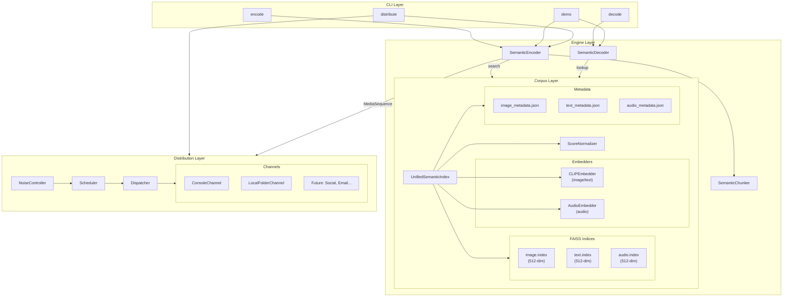

# DCASS System Architecture

## High-Level Architecture (4 Layers)

## Data Flow Overview

```mermaid
flowchart LR
    subgraph INPUT
        MSG["Secret Message"]
    end
    
    subgraph ENCODE
        CHUNK["Chunk Message"]
        SEARCH["Search Corpus"]
        SELECT["Select Media"]
    end
    
    subgraph TRANSMIT
        NOISE["Add Noise"]
        SCHEDULE["Schedule"]
        DISPATCH["Dispatch"]
    end
    
    subgraph OUTPUT
        CHAN["Channels"]
    end
    
    subgraph RECEIVE
        IDS["Media IDs"]
    end
    
    subgraph DECODE
        LOOKUP["Lookup IDs"]
        VERIFY["Verify"]
        EXTRACT["Extract Content"]
    end
    
    subgraph RESULT
        MEANING["Reconstructed<br/>Meaning"]
    end
    
    MSG --> CHUNK --> SEARCH --> SELECT
    SELECT --> |"Media IDs"| NOISE --> SCHEDULE --> DISPATCH --> CHAN
    CHAN -.-> |"observed"| IDS
    IDS --> LOOKUP --> VERIFY --> EXTRACT --> MEANING
```

## Component Details

### 1. CLI Layer
- **Purpose**: User interface for all DCASS operations
- **Commands**: encode, decode, demo, distribute
- **Implementation**: `src/cli/main.py`

### 2. Engine Layer
- **Purpose**: Core encoding/decoding logic
- **Components**:
  - `SemanticEncoder`: Message → Media sequence
  - `SemanticDecoder`: Media IDs → Reconstructed meaning
  - `SemanticChunker`: Message → Semantic chunks
- **Implementation**: `src/engine/`

### 3. Corpus Layer
- **Purpose**: Multi-modal semantic search
- **Components**:
  - `UnifiedSemanticIndex`: Unified search across modalities
  - `ScoreNormalizer`: Cross-modal score normalization
  - `CLIPEmbedder`: Image/text embeddings (512-dim)
  - `AudioEmbedder`: Audio embeddings via CLAP (512-dim)
- **Implementation**: `src/corpus/`

### 4. Distribution Layer
- **Purpose**: Human-like content distribution
- **Components**:
  - `NoiseController`: Adds jitter, skips, gaps
  - `Scheduler`: Timed dispatch
  - `Dispatcher`: Channel selection (round-robin, etc.)
  - Channels: Console, LocalFolder, (future: Social, Email)
- **Implementation**: `src/distribution/`
