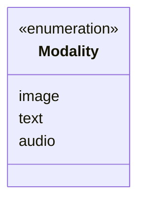

# DCASS Class Diagram

## Core Classes

```mermaid
classDiagram
    %% Engine Layer
    class SemanticEncoder {
        -UnifiedSemanticIndex index
        -SemanticChunker chunker
        -list~Modality~ default_modalities
        -bool _loaded
        +load() dict
        +encode(message, modalities, k) EncodingResult
        +encode_to_ids(message) list~str~
        +encode_images_only(message) list~str~
        +encode_text_only(message) list~str~
        +status() dict
    }

    class SemanticDecoder {
        -UnifiedSemanticIndex index
        -bool strict_verification
        -bool _loaded
        +load() dict
        +decode(media_ids) DecodingResult
        +decode_item(media_id) DecodedItem
        +decode_to_text(media_ids) str
        +verify(media_id) bool
        +status() dict
    }

    class SemanticChunker {
        -bool expand_synonyms
        -int min_chunk_length
        -str delimiters
        -dict synonyms
        +chunk(message) list~SemanticChunk~
        +chunk_simple(message) list~str~
        +reconstruct(chunks) str
    }

    %% Data Classes
    class EncodingResult {
        +str original_message
        +list~SemanticChunk~ chunks
        +list~EncodedChunk~ encoded
        +media_sequence: list~MediaItem~
        +media_ids: list~str~
        +modality_breakdown: dict
        +summary() str
    }

    class DecodingResult {
        +list~str~ media_ids
        +list~DecodedItem~ decoded
        +all_verified: bool
        +verification_rate: float
        +semantic_content: list~str~
        +reconstructed_meaning: str
        +summary() str
    }

    class SemanticChunk {
        +str text
        +str original
        +int index
    }

    class EncodedChunk {
        +SemanticChunk chunk
        +MediaItem media
        +list~MediaItem~ alternatives
    }

    class DecodedItem {
        +str media_id
        +Modality modality
        +str content
        +bool verified
        +dict metadata
    }

    %% Corpus Layer
    class UnifiedSemanticIndex {
        -Path base_path
        -str device
        -list~Modality~ enabled_modalities
        -dict~Modality,faiss.Index~ indices
        -dict~Modality,list~ metadata
        -ScoreNormalizer normalizer
        -bool _loaded
        +load(modalities) dict
        +search(query, k, modalities, min_score) list~MediaItem~
        +search_modality(query, modality, k) list~MediaItem~
        +get_by_id(item_id) MediaItem
        +status() dict
    }

    class ScoreNormalizer {
        -dict calibration
        +normalize(score, modality) float
        +update_calibration(modality, scores) void
    }

    class MediaItem {
        +str id
        +Modality modality
        +str content
        +float score
        +float normalized_score
        +dict metadata
    }

    %% Embedders
    class CLIPEmbedder {
        -str device
        -model _model
        -preprocess _preprocess
        +embed_text(text) ndarray
        +embed_texts(texts, batch_size) ndarray
        +embed_image(image) ndarray
        +embed_images(images, batch_size) ndarray
        +similarity(query, targets) ndarray
    }

    class AudioEmbedder {
        -str device
        -model _model
        -processor _processor
        +embed_text(text) ndarray
        +embed_texts(texts, batch_size) ndarray
        +embed_audio(audio) ndarray
        +embed_audios(audios, batch_size) ndarray
        +similarity(query, targets) ndarray
    }

    %% Distribution Layer
    class Dispatcher {
        -dict~str,BaseChannel~ channels
        -str policy
        +dispatch(image_sequence) list~dict~
        +dispatch_one(image_id, index) dict
    }

    class Scheduler {
        -Dispatcher dispatcher
        -list~int~ delays
        +run(image_sequence) list~dict~
    }

    class NoiseController {
        -Random random
        -float skip_prob
        -tuple jitter_range
        -float idle_gap_prob
        -tuple idle_gap_range
        +apply(images, delays) tuple
    }

    class BaseChannel {
        <<abstract>>
        +str name
        +send(image_id) dict
    }

    class ConsoleChannel {
        +str name
        +send(image_id) dict
    }

    class LocalFolderChannel {
        +str name
        -Path output_dir
        +send(image_id) dict
    }

    %% Relationships
    SemanticEncoder --> UnifiedSemanticIndex : uses
    SemanticEncoder --> SemanticChunker : uses
    SemanticEncoder --> EncodingResult : produces
    SemanticEncoder --> EncodedChunk : creates

    SemanticDecoder --> UnifiedSemanticIndex : uses
    SemanticDecoder --> DecodingResult : produces
    SemanticDecoder --> DecodedItem : creates

    SemanticChunker --> SemanticChunk : produces

    EncodingResult --> SemanticChunk : contains
    EncodingResult --> EncodedChunk : contains
    EncodedChunk --> MediaItem : references

    DecodingResult --> DecodedItem : contains

    UnifiedSemanticIndex --> ScoreNormalizer : uses
    UnifiedSemanticIndex --> MediaItem : produces
    UnifiedSemanticIndex --> CLIPEmbedder : uses
    UnifiedSemanticIndex --> AudioEmbedder : uses

    Scheduler --> Dispatcher : uses
    Dispatcher --> BaseChannel : uses
    NoiseController --> Scheduler : feeds

    ConsoleChannel --|> BaseChannel
    LocalFolderChannel --|> BaseChannel
```

## Modality Type

```mermaid
classDiagram
    class Modality {
        <<enumeration>>
        image
        text
        audio
    }
```
