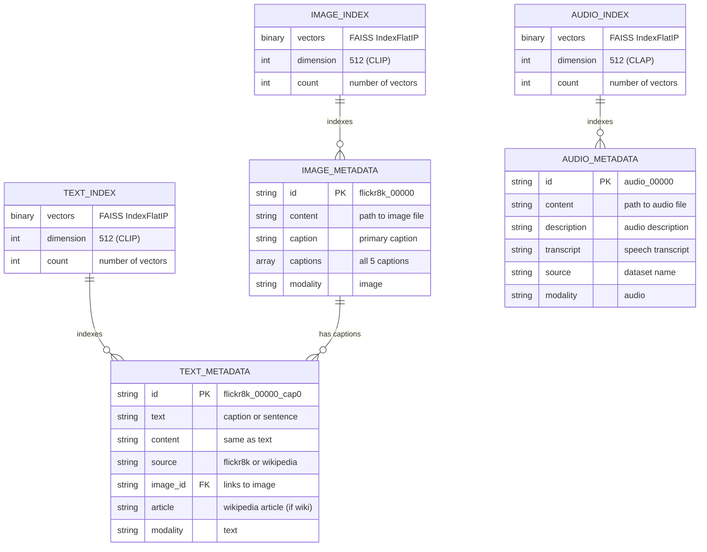
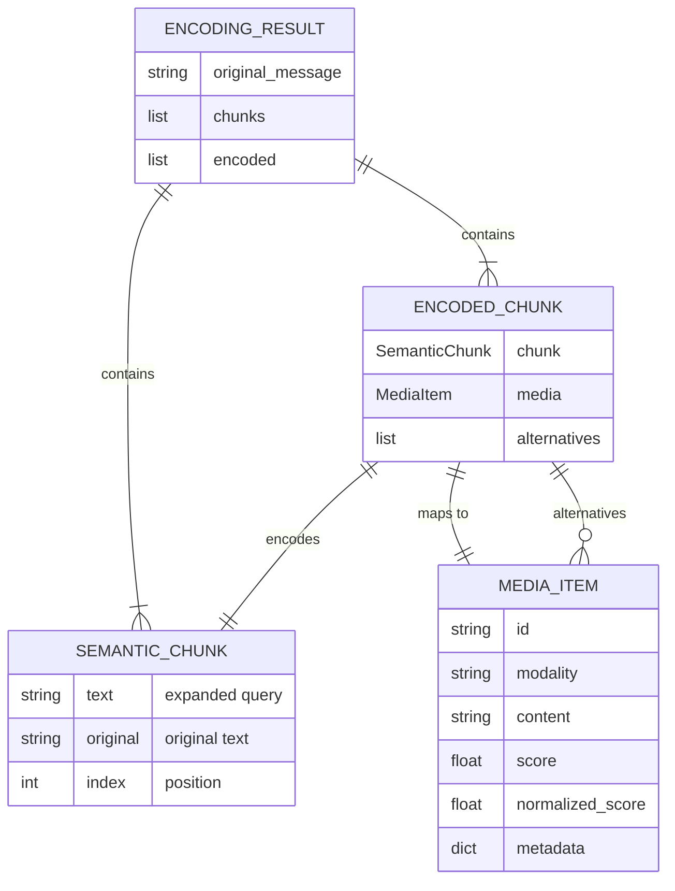
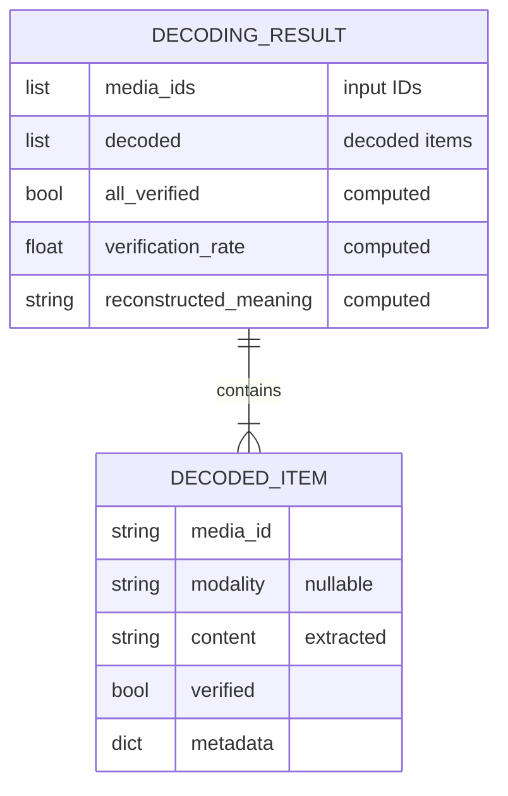
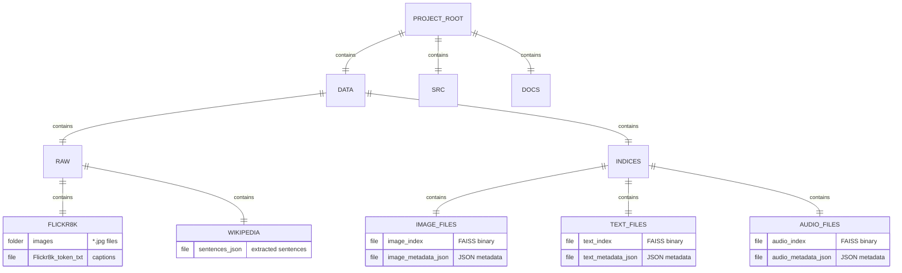

# Entity-Relationship Diagram

## Data Model



## Encoding Result Structure



## Decoding Result Structure



## File System Structure



## Metadata JSON Schemas

### Image Metadata
```json
{
  "id": "flickr8k_00000",
  "content": "data/raw/flickr8k/images/flickr8k_00000.jpg",
  "caption": "A black dog is running after a white dog in the snow.",
  "captions": [
    "A black dog is running after a white dog in the snow.",
    "Black dog chasing brown dog through snow",
    "Two dogs chase each other across the snowy ground.",
    "Two dogs play together in the snow.",
    "Two dogs running through a low lying body of water."
  ],
  "modality": "image"
}
```

### Text Metadata (Flickr Caption)
```json
{
  "id": "flickr8k_00000_cap0",
  "text": "A black dog is running after a white dog in the snow.",
  "content": "A black dog is running after a white dog in the snow.",
  "source": "flickr8k",
  "image_id": "flickr8k_00000",
  "modality": "text"
}
```

### Text Metadata (Wikipedia)
```json
{
  "id": "wiki_000000",
  "text": "April is the fourth month of the year.",
  "content": "April is the fourth month of the year.",
  "source": "wikipedia",
  "article": "April",
  "modality": "text"
}
```

### Audio Metadata (Planned)
```json
{
  "id": "audio_00000",
  "content": "data/raw/audio/audio_00000.wav",
  "description": "A dog barking loudly",
  "transcript": "Woof woof woof",
  "source": "libretta",
  "modality": "audio"
}
```
