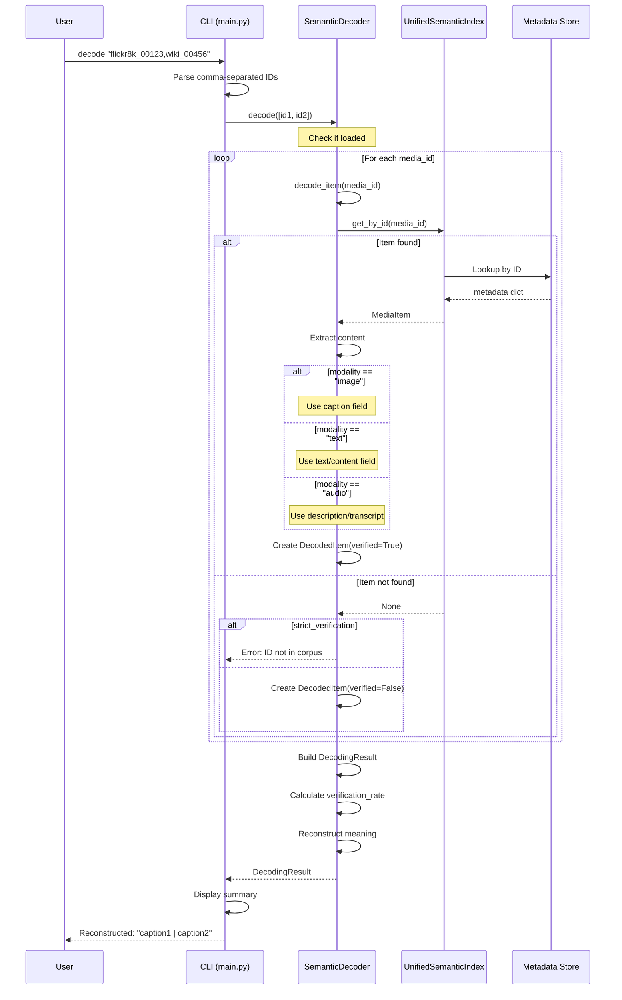
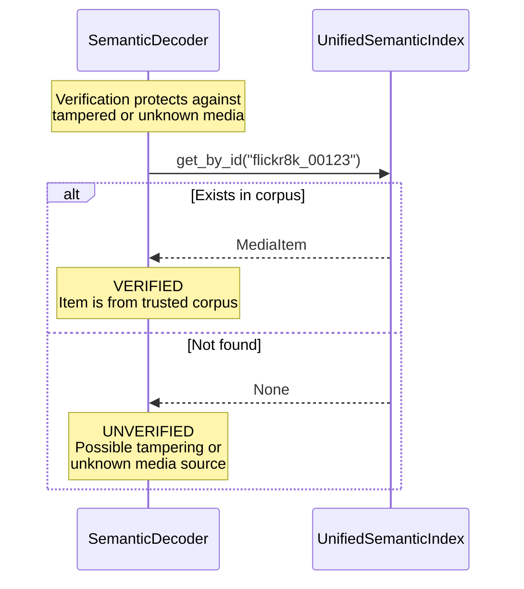
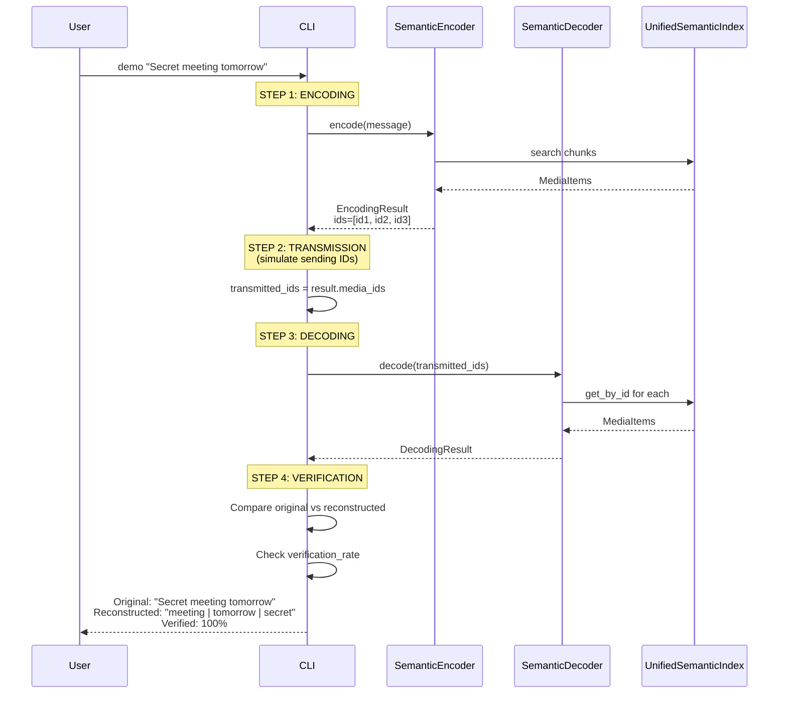

# Decoding Sequence Diagram

## Media Sequence Decoding Flow

```mermaid
sequenceDiagram
    participant User
    participant CLI as CLI (main.py)
    participant Decoder as SemanticDecoder
    participant Index as UnifiedSemanticIndex
    participant Metadata as Metadata Store

    User->>CLI: decode "flickr8k_00123,wiki_00456"
    CLI->>CLI: Parse comma-separated IDs
    CLI->>Decoder: decode([id1, id2])
    
    Note over Decoder: Check if loaded
    
    loop For each media_id
        Decoder->>Decoder: decode_item(media_id)
        Decoder->>Index: get_by_id(media_id)
        
        alt Item found
            Index->>Metadata: Lookup by ID
            Metadata-->>Index: metadata dict
            Index-->>Decoder: MediaItem
            
            Decoder->>Decoder: Extract content
            
            alt modality == "image"
                Note over Decoder: Use caption field
            else modality == "text"
                Note over Decoder: Use text/content field
            else modality == "audio"
                Note over Decoder: Use description/transcript
            end
            
            Decoder->>Decoder: Create DecodedItem(verified=True)
        else Item not found
            Index-->>Decoder: None
            
            alt strict_verification
                Decoder-->>CLI: Error: ID not in corpus
            else
                Decoder->>Decoder: Create DecodedItem(verified=False)
            end
        end
    end
    
    Decoder->>Decoder: Build DecodingResult
    Decoder->>Decoder: Calculate verification_rate
    Decoder->>Decoder: Reconstruct meaning
    
    Decoder-->>CLI: DecodingResult
    CLI->>CLI: Display summary
    CLI-->>User: Reconstructed: "caption1 | caption2"
```

## Verification Flow

```mermaid
sequenceDiagram
    participant Decoder as SemanticDecoder
    participant Index as UnifiedSemanticIndex

    Note over Decoder: Verification protects against<br/>tampered or unknown media

    Decoder->>Index: get_by_id("flickr8k_00123")
    
    alt Exists in corpus
        Index-->>Decoder: MediaItem
        Note over Decoder: VERIFIED<br/>Item is from trusted corpus
    else Not found
        Index-->>Decoder: None
        Note over Decoder: UNVERIFIED<br/>Possible tampering or<br/>unknown media source
    end
```

## Full Demo Flow (Encode + Decode)

```mermaid
sequenceDiagram
    participant User
    participant CLI
    participant Encoder as SemanticEncoder
    participant Decoder as SemanticDecoder
    participant Index as UnifiedSemanticIndex

    User->>CLI: demo "Secret meeting tomorrow"
    
    Note over CLI: STEP 1: ENCODING
    CLI->>Encoder: encode(message)
    Encoder->>Index: search chunks
    Index-->>Encoder: MediaItems
    Encoder-->>CLI: EncodingResult<br/>ids=[id1, id2, id3]
    
    Note over CLI: STEP 2: TRANSMISSION<br/>(simulate sending IDs)
    CLI->>CLI: transmitted_ids = result.media_ids
    
    Note over CLI: STEP 3: DECODING
    CLI->>Decoder: decode(transmitted_ids)
    Decoder->>Index: get_by_id for each
    Index-->>Decoder: MediaItems
    Decoder-->>CLI: DecodingResult
    
    Note over CLI: STEP 4: VERIFICATION
    CLI->>CLI: Compare original vs reconstructed
    CLI->>CLI: Check verification_rate
    
    CLI-->>User: Original: "Secret meeting tomorrow"<br/>Reconstructed: "meeting | tomorrow | secret"<br/>Verified: 100%
```
