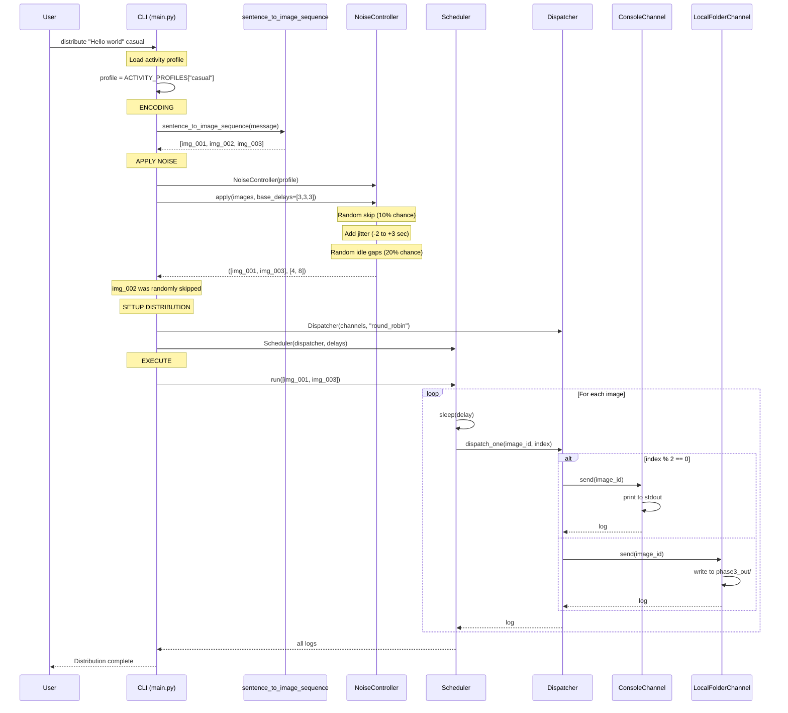
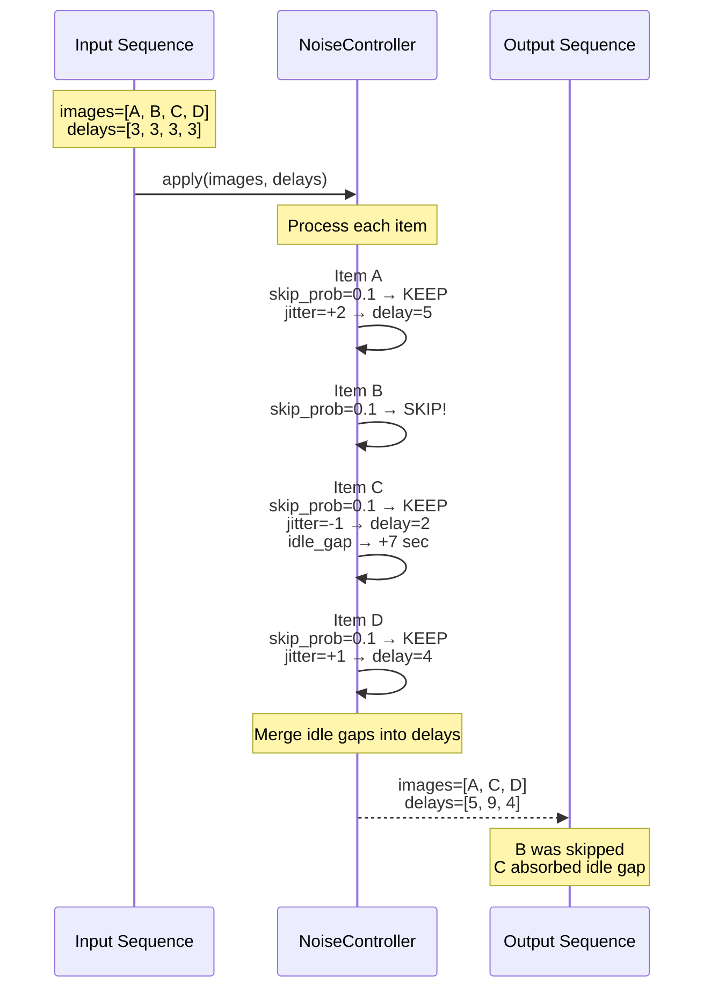
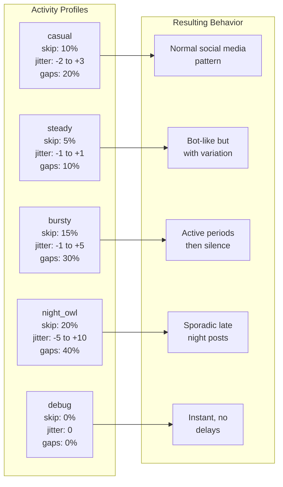
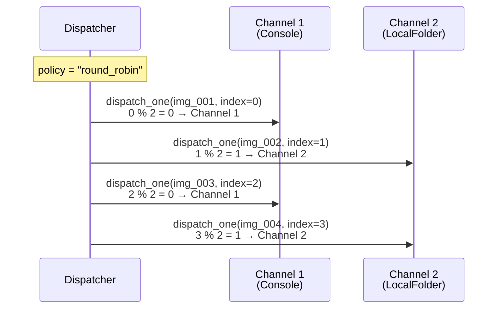

# Distribution Sequence Diagram

## Full Distribution Pipeline

```mermaid
sequenceDiagram
    participant User
    participant CLI as CLI (main.py)
    participant Encoder as sentence_to_image_sequence
    participant Noise as NoiseController
    participant Sched as Scheduler
    participant Disp as Dispatcher
    participant Console as ConsoleChannel
    participant Folder as LocalFolderChannel

    User->>CLI: distribute "Hello world" casual
    
    Note over CLI: Load activity profile
    CLI->>CLI: profile = ACTIVITY_PROFILES["casual"]
    
    Note over CLI: ENCODING
    CLI->>Encoder: sentence_to_image_sequence(message)
    Encoder-->>CLI: [img_001, img_002, img_003]
    
    Note over CLI: APPLY NOISE
    CLI->>Noise: NoiseController(profile)
    CLI->>Noise: apply(images, base_delays=[3,3,3])
    
    Note over Noise: Random skip (10% chance)
    Note over Noise: Add jitter (-2 to +3 sec)
    Note over Noise: Random idle gaps (20% chance)
    
    Noise-->>CLI: ([img_001, img_003], [4, 8])
    Note over CLI: img_002 was randomly skipped
    
    Note over CLI: SETUP DISTRIBUTION
    CLI->>Disp: Dispatcher(channels, "round_robin")
    CLI->>Sched: Scheduler(dispatcher, delays)
    
    Note over CLI: EXECUTE
    CLI->>Sched: run([img_001, img_003])
    
    loop For each image
        Sched->>Sched: sleep(delay)
        Sched->>Disp: dispatch_one(image_id, index)
        
        alt index % 2 == 0
            Disp->>Console: send(image_id)
            Console->>Console: print to stdout
            Console-->>Disp: log
        else
            Disp->>Folder: send(image_id)
            Folder->>Folder: write to phase3_out/
            Folder-->>Disp: log
        end
        
        Disp-->>Sched: log
    end
    
    Sched-->>CLI: all logs
    CLI-->>User: Distribution complete
```

## Noise Controller Detail

```mermaid
sequenceDiagram
    participant Input as Input Sequence
    participant Noise as NoiseController
    participant Output as Output Sequence

    Note over Input: images=[A, B, C, D]<br/>delays=[3, 3, 3, 3]
    
    Input->>Noise: apply(images, delays)
    
    Note over Noise: Process each item
    
    Noise->>Noise: Item A<br/>skip_prob=0.1 → KEEP<br/>jitter=+2 → delay=5
    Noise->>Noise: Item B<br/>skip_prob=0.1 → SKIP!
    Noise->>Noise: Item C<br/>skip_prob=0.1 → KEEP<br/>jitter=-1 → delay=2<br/>idle_gap → +7 sec
    Noise->>Noise: Item D<br/>skip_prob=0.1 → KEEP<br/>jitter=+1 → delay=4
    
    Note over Noise: Merge idle gaps into delays
    
    Noise-->>Output: images=[A, C, D]<br/>delays=[5, 9, 4]
    
    Note over Output: B was skipped<br/>C absorbed idle gap
```

## Activity Profiles

```mermaid
flowchart LR
    subgraph Profiles["Activity Profiles"]
        CASUAL["casual<br/>skip: 10%<br/>jitter: -2 to +3<br/>gaps: 20%"]
        STEADY["steady<br/>skip: 5%<br/>jitter: -1 to +1<br/>gaps: 10%"]
        BURSTY["bursty<br/>skip: 15%<br/>jitter: -1 to +5<br/>gaps: 30%"]
        NIGHT["night_owl<br/>skip: 20%<br/>jitter: -5 to +10<br/>gaps: 40%"]
        DEBUG["debug<br/>skip: 0%<br/>jitter: 0<br/>gaps: 0%"]
    end
    
    subgraph Behavior["Resulting Behavior"]
        B_CASUAL["Normal social media<br/>pattern"]
        B_STEADY["Bot-like but<br/>with variation"]
        B_BURSTY["Active periods<br/>then silence"]
        B_NIGHT["Sporadic late<br/>night posts"]
        B_DEBUG["Instant, no<br/>delays"]
    end
    
    CASUAL --> B_CASUAL
    STEADY --> B_STEADY
    BURSTY --> B_BURSTY
    NIGHT --> B_NIGHT
    DEBUG --> B_DEBUG
```

## Channel Selection (Round Robin)

```mermaid
sequenceDiagram
    participant Disp as Dispatcher
    participant C1 as Channel 1<br/>(Console)
    participant C2 as Channel 2<br/>(LocalFolder)

    Note over Disp: policy = "round_robin"
    
    Disp->>C1: dispatch_one(img_001, index=0)<br/>0 % 2 = 0 → Channel 1
    Disp->>C2: dispatch_one(img_002, index=1)<br/>1 % 2 = 1 → Channel 2
    Disp->>C1: dispatch_one(img_003, index=2)<br/>2 % 2 = 0 → Channel 1
    Disp->>C2: dispatch_one(img_004, index=3)<br/>3 % 2 = 1 → Channel 2
```
