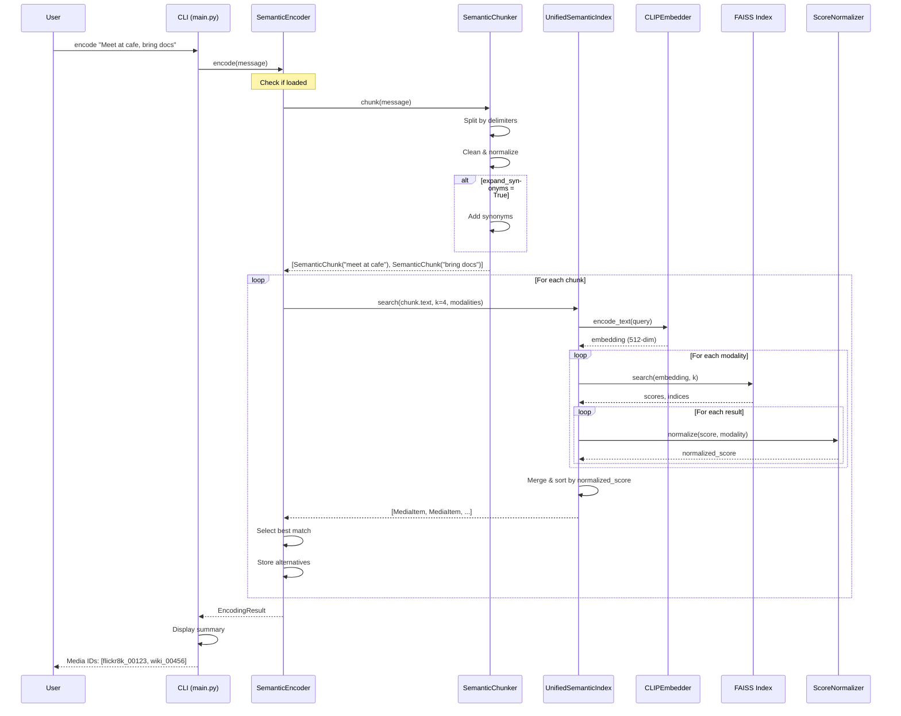
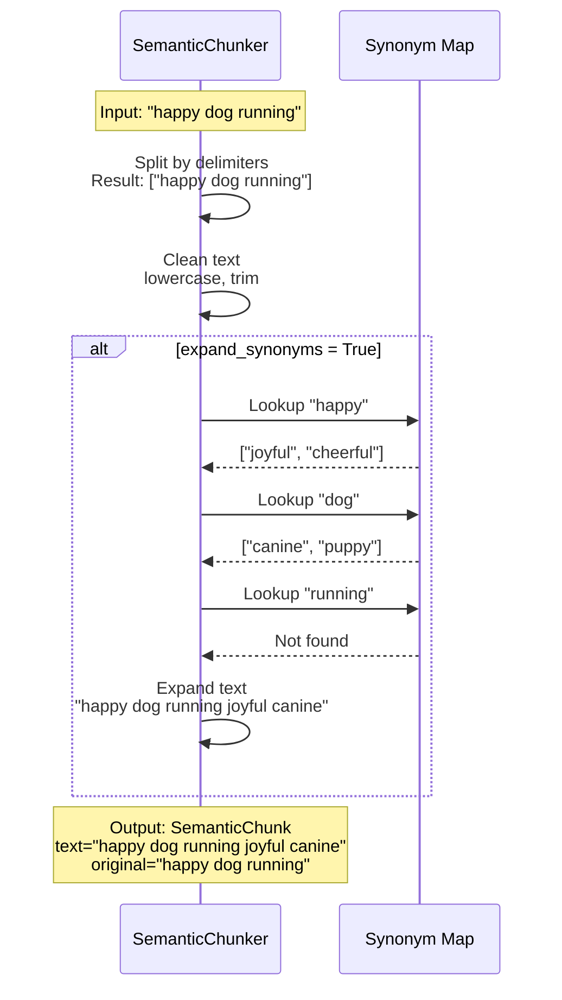
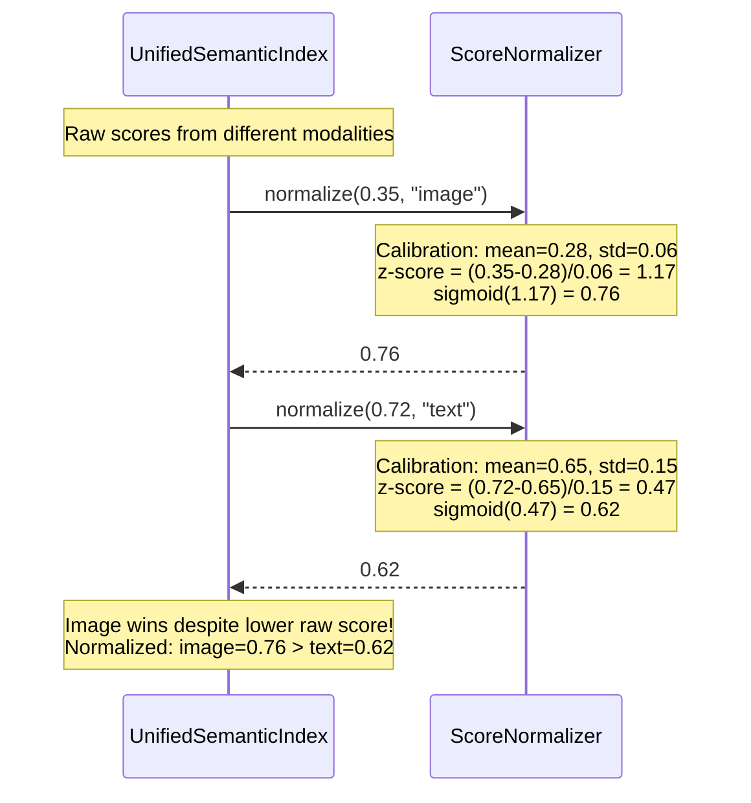

# Encoding Sequence Diagram

## Message Encoding Flow

```mermaid
sequenceDiagram
    participant User
    participant CLI as CLI (main.py)
    participant Encoder as SemanticEncoder
    participant Chunker as SemanticChunker
    participant Index as UnifiedSemanticIndex
    participant CLIP as CLIPEmbedder
    participant FAISS as FAISS Index
    participant Normalizer as ScoreNormalizer

    User->>CLI: encode "Meet at cafe, bring docs"
    CLI->>Encoder: encode(message)
    
    Note over Encoder: Check if loaded
    
    Encoder->>Chunker: chunk(message)
    Chunker->>Chunker: Split by delimiters
    Chunker->>Chunker: Clean & normalize
    
    alt expand_synonyms = True
        Chunker->>Chunker: Add synonyms
    end
    
    Chunker-->>Encoder: [SemanticChunk("meet at cafe"), SemanticChunk("bring docs")]
    
    loop For each chunk
        Encoder->>Index: search(chunk.text, k=4, modalities)
        Index->>CLIP: encode_text(query)
        CLIP-->>Index: embedding (512-dim)
        
        loop For each modality
            Index->>FAISS: search(embedding, k)
            FAISS-->>Index: scores, indices
            
            loop For each result
                Index->>Normalizer: normalize(score, modality)
                Normalizer-->>Index: normalized_score
            end
        end
        
        Index->>Index: Merge & sort by normalized_score
        Index-->>Encoder: [MediaItem, MediaItem, ...]
        
        Encoder->>Encoder: Select best match
        Encoder->>Encoder: Store alternatives
    end
    
    Encoder-->>CLI: EncodingResult
    CLI->>CLI: Display summary
    CLI-->>User: Media IDs: [flickr8k_00123, wiki_00456]
```

## Detailed Chunk Processing

```mermaid
sequenceDiagram
    participant Chunker as SemanticChunker
    participant Synonyms as Synonym Map

    Note over Chunker: Input: "happy dog running"
    
    Chunker->>Chunker: Split by delimiters<br/>Result: ["happy dog running"]
    
    Chunker->>Chunker: Clean text<br/>lowercase, trim
    
    alt expand_synonyms = True
        Chunker->>Synonyms: Lookup "happy"
        Synonyms-->>Chunker: ["joyful", "cheerful"]
        
        Chunker->>Synonyms: Lookup "dog"
        Synonyms-->>Chunker: ["canine", "puppy"]
        
        Chunker->>Synonyms: Lookup "running"
        Synonyms-->>Chunker: Not found
        
        Chunker->>Chunker: Expand text<br/>"happy dog running joyful canine"
    end
    
    Note over Chunker: Output: SemanticChunk<br/>text="happy dog running joyful canine"<br/>original="happy dog running"
```

## Score Normalization

```mermaid
sequenceDiagram
    participant Index as UnifiedSemanticIndex
    participant Norm as ScoreNormalizer

    Note over Index: Raw scores from different modalities
    
    Index->>Norm: normalize(0.35, "image")
    Note over Norm: Calibration: mean=0.28, std=0.06<br/>z-score = (0.35-0.28)/0.06 = 1.17<br/>sigmoid(1.17) = 0.76
    Norm-->>Index: 0.76
    
    Index->>Norm: normalize(0.72, "text")
    Note over Norm: Calibration: mean=0.65, std=0.15<br/>z-score = (0.72-0.65)/0.15 = 0.47<br/>sigmoid(0.47) = 0.62
    Norm-->>Index: 0.62
    
    Note over Index: Image wins despite lower raw score!<br/>Normalized: image=0.76 > text=0.62
```
