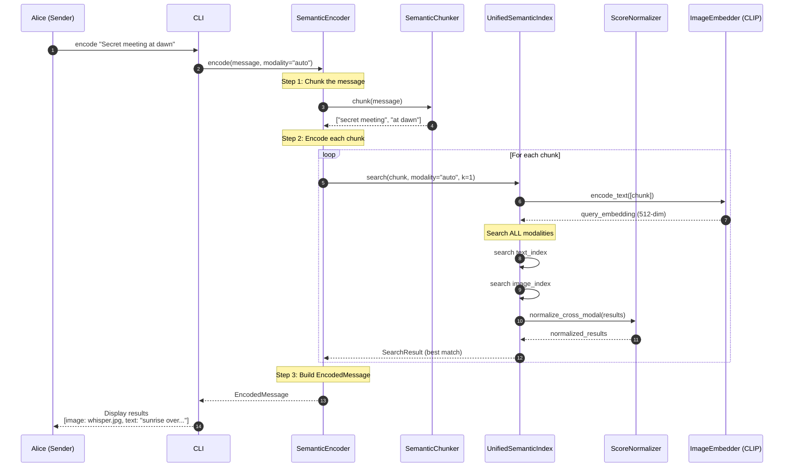
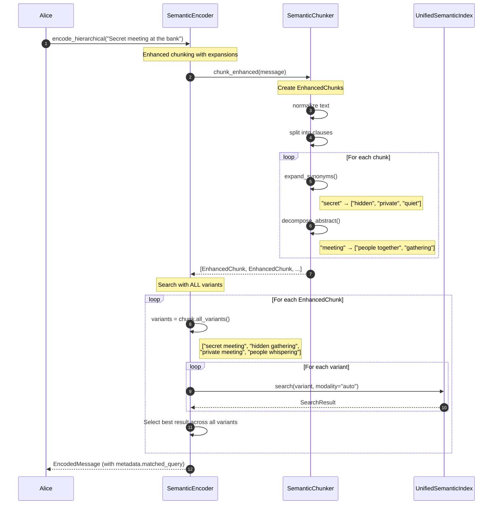
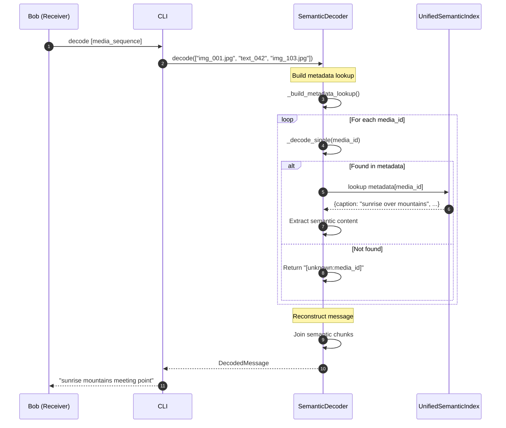
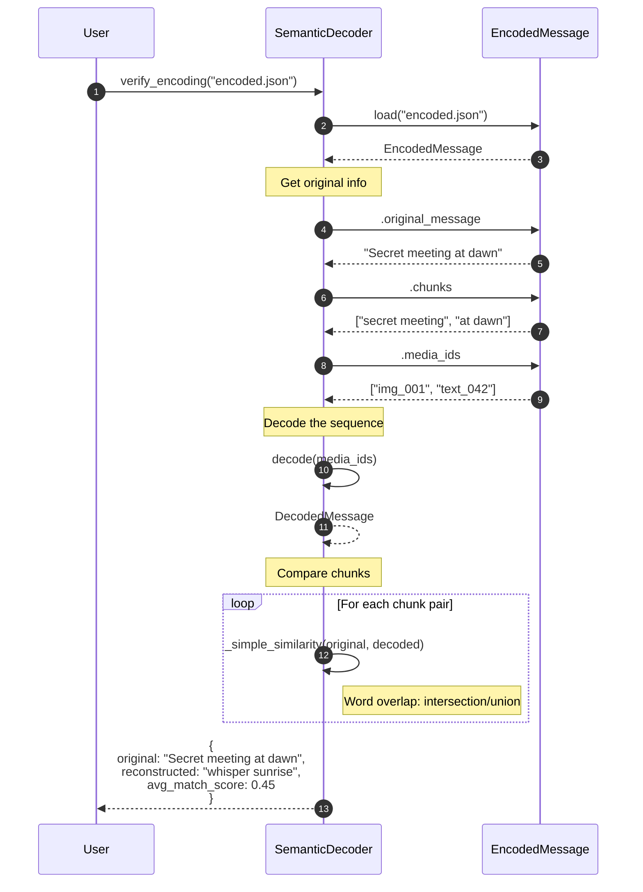
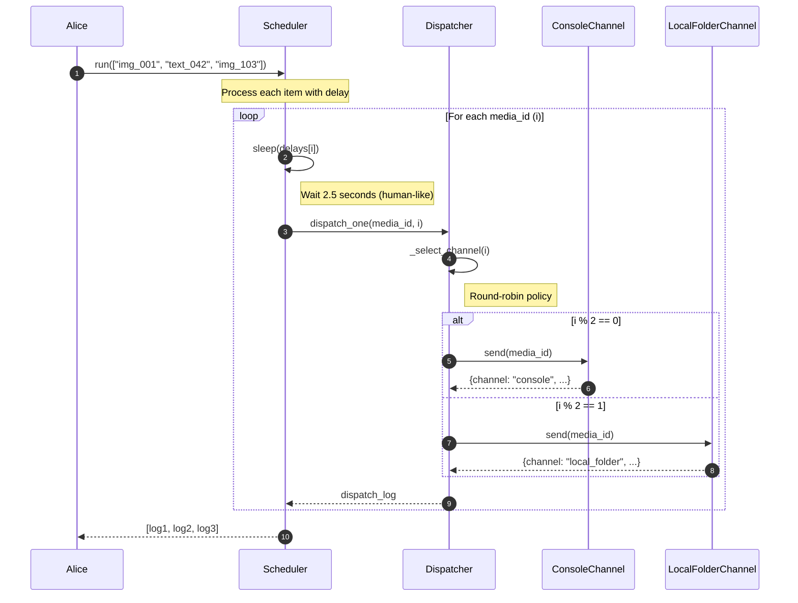
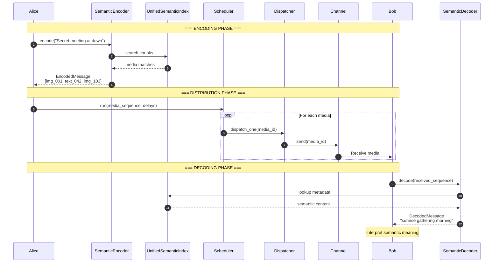
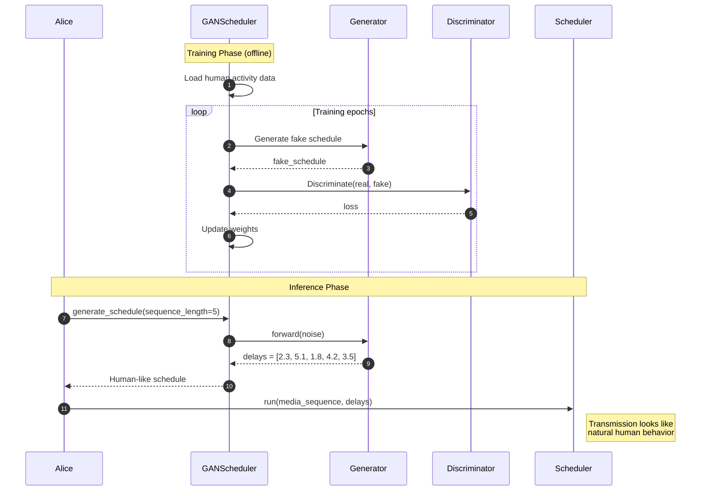
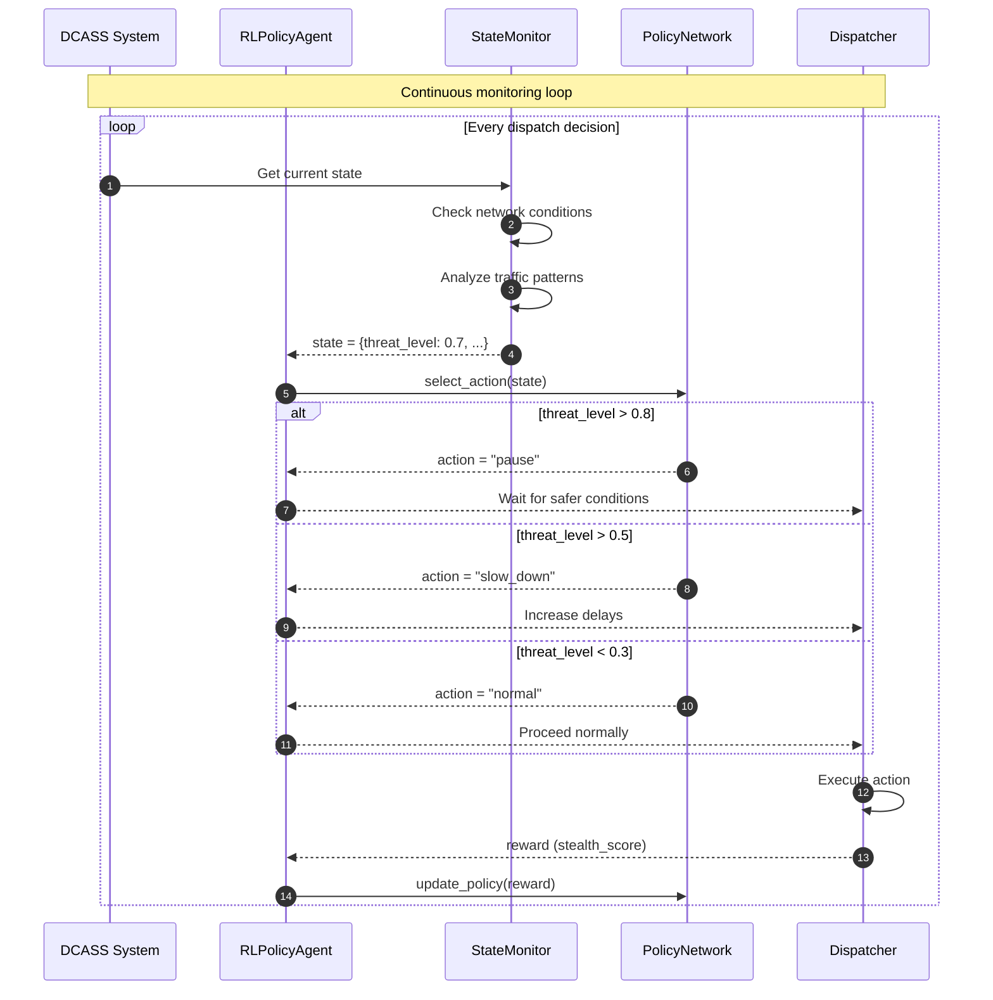

# DCASS Sequence Diagrams

## 1. Basic Encoding Flow

## 2. Hierarchical Encoding Flow (with Synonyms)

## 3. Decoding Flow

## 4. Verification Flow

## 5. Distribution Flow

## 6. Full Pipeline Flow (End-to-End)

## 7. GAN Scheduler Flow (PLANNED - NOT IMPLEMENTED)

## 8. RL Policy Agent Flow (PLANNED - NOT IMPLEMENTED)

## Sequence Diagram Summary

| Diagram | Description | Status |
|---------|-------------|--------|
| Basic Encoding | Standard encoding flow | Implemented |
| Hierarchical Encoding | Encoding with synonym expansion | Implemented |
| Decoding | Message reconstruction | Implemented |
| Verification | Round-trip verification | Implemented |
| Distribution | Multi-channel dispatch | Implemented |
| Full Pipeline | End-to-end flow | Implemented |
| GAN Scheduler | Human behavior mimicry | Not Implemented |
| RL Policy Agent | Adaptive decision making | Not Implemented |
