# DCASS Use Case Diagram

## Actors and Use Cases

```mermaid
flowchart TB
    subgraph Actors
        ALICE((Alice<br/>Sender))
        BOB((Bob<br/>Receiver))
        ADMIN((Admin))
        EVE((Eve<br/>Adversary))
    end

    subgraph UC_Encoding["Encoding Use Cases"]
        UC1[Encode Secret Message]
        UC2[Encode with Synonyms<br/>Hierarchical Encoding]
        UC3[Select Modality<br/>auto/text/image]
        UC4[View Encoding Statistics]
        UC5[Save Encoded Message]
    end

    subgraph UC_Decoding["Decoding Use Cases"]
        UC6[Decode Media Sequence]
        UC7[Verify Encoding]
        UC8[Load Encoded File]
    end

    subgraph UC_Distribution["Distribution Use Cases"]
        UC9[Dispatch to Channel]
        UC10[Schedule Transmission]
        UC11[Configure Channels]
        UC12[View Dispatch Logs]
    end

    subgraph UC_Stealth["Stealth Use Cases (NOT IMPLEMENTED)"]
        UC13[Generate Human-like Schedule<br/>GAN Scheduler]
        UC14[Adapt to Threat Level<br/>RL Policy Agent]
        UC15[Monitor Network Conditions]
    end

    subgraph UC_Admin["Admin Use Cases"]
        UC16[Build Indices]
        UC17[Download Datasets]
        UC18[Configure System]
        UC19[View System Status]
    end

    subgraph UC_Analysis["Analysis Use Cases (NOT IMPLEMENTED)"]
        UC20[Run Benchmarks]
        UC21[Calculate Stealth Metrics]
        UC22[Perform Adversarial Testing]
        UC23[Detect Hidden Messages]
    end

    %% Alice (Sender) relationships
    ALICE --> UC1
    ALICE --> UC2
    ALICE --> UC3
    ALICE --> UC4
    ALICE --> UC5
    ALICE --> UC9
    ALICE --> UC10
    UC1 --> UC13
    UC10 --> UC14

    %% Bob (Receiver) relationships
    BOB --> UC6
    BOB --> UC7
    BOB --> UC8

    %% Admin relationships
    ADMIN --> UC16
    ADMIN --> UC17
    ADMIN --> UC18
    ADMIN --> UC19
    ADMIN --> UC11
    ADMIN --> UC12
    ADMIN --> UC20
    ADMIN --> UC21

    %% Eve (Adversary) relationships
    EVE --> UC22
    EVE --> UC23

    %% Dependencies
    UC2 -.-> UC1
    UC3 -.-> UC1
    UC7 -.-> UC6
    UC10 -.-> UC9
    UC13 -.-> UC10
    UC14 -.-> UC9
    UC15 -.-> UC14

    %% Styling
    classDef implemented fill:#90EE90,stroke:#228B22,color:#000
    classDef notImplemented fill:#FFB6C1,stroke:#DC143C,color:#000
    classDef actor fill:#87CEEB,stroke:#4169E1,color:#000

    class UC1,UC2,UC3,UC4,UC5,UC6,UC7,UC8,UC9,UC10,UC11,UC12,UC16,UC17,UC18,UC19 implemented
    class UC13,UC14,UC15,UC20,UC21,UC22,UC23 notImplemented
    class ALICE,BOB,ADMIN,EVE actor
```



## Use Case Descriptions

### Encoding Use Cases

| ID | Use Case | Actor | Description | Status |
|----|----------|-------|-------------|--------|
| UC1 | Encode Secret Message | Alice | Encode a text message into a sequence of media | Implemented |
| UC2 | Encode with Synonyms | Alice | Use hierarchical encoding with synonym expansion | Implemented |
| UC3 | Select Modality | Alice | Choose auto (mixed), text-only, or image-only | Implemented |
| UC4 | View Encoding Statistics | Alice | See match scores, modality distribution, etc. | Implemented |
| UC5 | Save Encoded Message | Alice | Save encoded message to JSON file | Implemented |

### Decoding Use Cases

| ID | Use Case | Actor | Description | Status |
|----|----------|-------|-------------|--------|
| UC6 | Decode Media Sequence | Bob | Reconstruct message from media sequence | Implemented |
| UC7 | Verify Encoding | Bob | Verify decoded message matches original | Implemented |
| UC8 | Load Encoded File | Bob | Load encoded message from JSON file | Implemented |

### Distribution Use Cases

| ID | Use Case | Actor | Description | Status |
|----|----------|-------|-------------|--------|
| UC9 | Dispatch to Channel | Alice | Send media through configured channels | Implemented |
| UC10 | Schedule Transmission | Alice | Add delays between transmissions | Implemented (basic) |
| UC11 | Configure Channels | Admin | Set up output channels | Implemented |
| UC12 | View Dispatch Logs | Admin | See transmission history | Implemented |

### Stealth Use Cases (NOT IMPLEMENTED)

| ID | Use Case | Actor | Description | Status |
|----|----------|-------|-------------|--------|
| UC13 | Generate Human-like Schedule | Alice | Use GAN to create realistic timing | Not Implemented |
| UC14 | Adapt to Threat Level | Alice | Use RL agent for adaptive decisions | Not Implemented |
| UC15 | Monitor Network Conditions | System | Track threat indicators | Not Implemented |

### Admin Use Cases

| ID | Use Case | Actor | Description | Status |
|----|----------|-------|-------------|--------|
| UC16 | Build Indices | Admin | Create FAISS indices from datasets | Implemented |
| UC17 | Download Datasets | Admin | Download Flickr8k, Wikipedia, etc. | Implemented |
| UC18 | Configure System | Admin | Set paths, models, parameters | Implemented |
| UC19 | View System Status | Admin | Check index status, loaded models | Implemented |

### Analysis Use Cases (NOT IMPLEMENTED)

| ID | Use Case | Actor | Description | Status |
|----|----------|-------|-------------|--------|
| UC20 | Run Benchmarks | Admin | Measure accuracy, latency, capacity | Not Implemented |
| UC21 | Calculate Stealth Metrics | Admin | Compute detectability metrics | Not Implemented |
| UC22 | Perform Adversarial Testing | Eve | Test against detection algorithms | Not Implemented |
| UC23 | Detect Hidden Messages | Eve | Attempt to detect steganography | Not Implemented |

## Actor Descriptions

### Alice (Sender)
The sender who wants to communicate covertly. Alice:
- Composes secret messages
- Encodes them into media sequences
- Configures transmission schedules
- Dispatches media through channels

### Bob (Receiver)
The receiver who receives the covert communication. Bob:
- Receives media sequences through shared channels
- Decodes media back to semantic meaning
- Verifies message integrity

### Admin
System administrator who manages the DCASS system. Admin:
- Downloads and indexes datasets
- Configures system parameters
- Monitors system health
- Runs benchmarks and analysis

### Eve (Adversary)
An adversary attempting to detect hidden communications. Eve:
- Analyzes traffic patterns
- Runs steganalysis algorithms
- Attempts to detect statistical anomalies

## User Stories

### Alice's Story (Encoding Flow)
```
As Alice, I want to:
1. Enter my secret message: "Meeting at dawn by the old bridge"
2. Choose mixed-modality encoding (auto)
3. Enable synonym expansion for better matching
4. Review the encoding statistics (scores, modalities used)
5. Schedule transmission with human-like delays (GAN - future)
6. Dispatch through multiple channels
```

### Bob's Story (Decoding Flow)
```
As Bob, I want to:
1. Receive a sequence of images and texts
2. Load the media into the decoder
3. Reconstruct the semantic meaning
4. Verify the message makes sense
5. Understand the original intent
```

### Admin's Story (Setup Flow)
```
As Admin, I want to:
1. Download the Flickr8k dataset
2. Download Wikipedia sentences
3. Build FAISS indices for both modalities
4. Verify indices are loaded correctly
5. Run benchmarks to measure performance
```

### Eve's Story (Detection Flow)
```
As Eve, I want to:
1. Monitor traffic for anomalies
2. Analyze transmission timing patterns
3. Run statistical tests on media selections
4. Determine if covert communication is occurring
```
